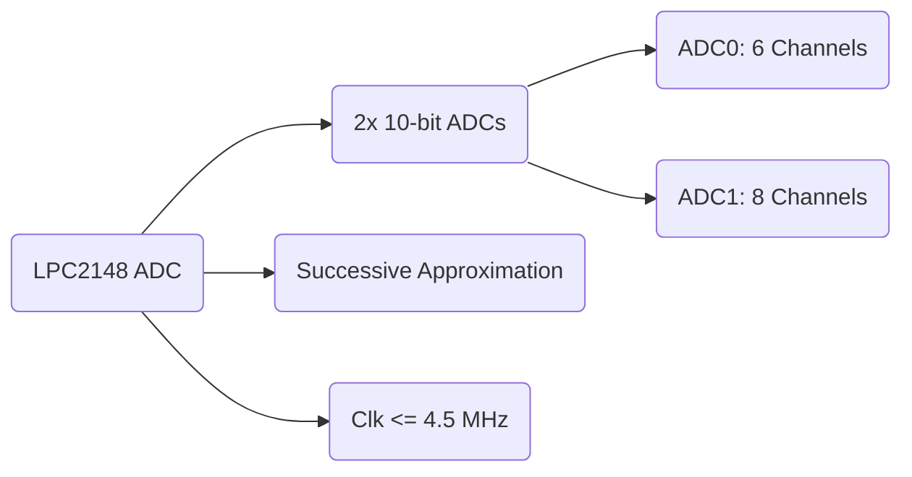
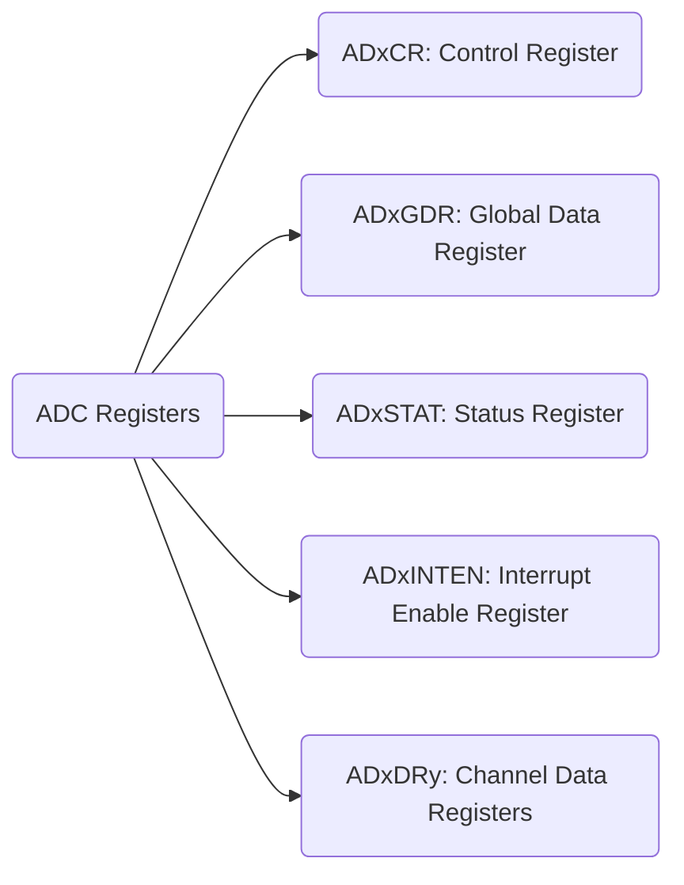
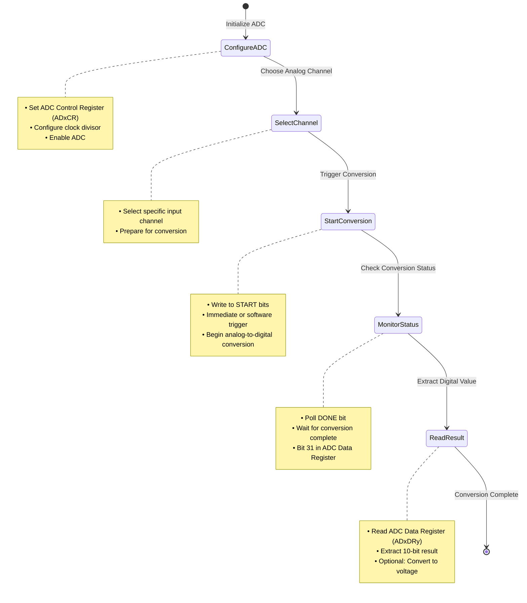

# Analog-to-Digital Converter (ADC) in LPC2148

## LPC2148 ADC Basics

- **Number of ADCs**: Two 10-bit ADCs - ADC0 and ADC1.
- **Channels**:
  - ADC0: 6 channels.
  - ADC1: 8 channels.
- **Conversion Technique**: Successive Approximation (iterative narrowing down of value range).
- **Clock Requirement**: ADC clock frequency must be 4.5 MHz or less, adjustable via a clock divider.
- **Voltage Range**: ADCs operate between 0V and a reference voltage (VREF), typically 3V, but not exceeding the microcontroller's supply voltage (VDDA).

### Mermaid Diagram: ADC Features



## Key ADC Concepts

1. **Channels**:
   - Dedicated input paths for specific analog signals.
   - Useful for connecting various sensors.
2. **Clock**:
   - Drives the ADC operation.
   - Requires careful configuration to meet speed and accuracy demands.
3. **Precision**:
   - 10-bit resolution translates to 1024 discrete levels.
   - Ensures fine-grained signal representation.

## Registers Overview

### Important Registers

1. **ADOCR (ADC Control Register)**:

   - Configures ADC operation.
   - Key Fields:
     - **SEL (Bits 7:0)**: Selects the ADC channel.
     - **CLKDIV (Bits 15:8)**: Sets clock division to adjust ADC clock frequency.
     - **BURST (Bit 16)**: Enables repeated conversions without software intervention.
     - **CLKS (Bits 19:17)**: Configures the number of clocks and precision.
     - **PDN (Bit 21)**: Powers up the ADC.
     - **START (Bits 26:24)**: Controls conversion start triggers.
     - **EDGE (Bit 27)**: Defines trigger edge for external signals.

2. **ADGDR (ADC Global Data Register)**:

   - Stores the result of the most recent conversion.
   - Key Fields:
     - **DONE (Bit 31)**: Indicates conversion completion.
     - **RESULT (Bits 15:6)**: Holds the 10-bit conversion value.

3. **ADSTAT (ADC Status Register)**:

   - Reflects status flags for all channels.
   - Key Fields:
     - **DONE7:0**: Conversion completion flags for each channel.
     - **OVERRUN7:0**: Indicates data loss due to overwritten results.
     - **ADINT**: Signals interrupt for completed conversions.

4. **ADINTEN (ADC Interrupt Enable Register)**:

   - Enables interrupt generation for specific channels.
   - Key Fields:
     - **EN7:0**: Enables interrupts for individual channels.
     - **ADGINTEN**: Enables global interrupt for any channel completion.

5. **ADxDR (ADC Data Registers)**:

   - Individual registers for each channel.
   - Key Fields:
     - **RESULT (Bits 15:6)**: Stores the conversion result.
     - **DONE (Bit 31)**: Flags conversion completion for the specific channel.

### Registers Names



### Summary of Key Configurations

- Configure **ADOCR** for:
  - Channel selection.
  - ADC clock setup.
  - Enabling burst or software-controlled modes.
- Use **ADGDR** and **ADxDR** to read conversion results.
- Leverage **ADSTAT** for monitoring channel statuses.
- Enable interrupts via **ADINTEN** for efficient ADC event handling.

### Missed Points

#### CLKS Bits (Bits 19:17)

- These bits configure the number of clocks used for each conversion in burst mode and determine the accuracy of the conversion result.
- **Values**:
  - `000`: 11 clocks for 10-bit resolution.
  - `001`: 10 clocks for 9-bit resolution.
  - `010`: 9 clocks for 8-bit resolution.
  - `011`: 8 clocks for 7-bit resolution.
  - `100`: 7 clocks for 6-bit resolution.
  - `101`: 6 clocks for 5-bit resolution.
  - `110`: 5 clocks for 4-bit resolution.
  - `111`: 4 clocks for 3-bit resolution.

#### START Bits (Bits 26:24)

- Define how and when the ADC conversion process begins.
- **Values**:
  - `000`: No start; used when clearing power-down mode.
  - `001`: Start conversion immediately.
  - `010` to `111`: Start conversion triggered by external MAT or CAP signals (controlled by the EDGE bit).

These additional configurations enhance flexibility, allowing for tailored precision and trigger mechanisms in ADC operations.

### Register Summary Table

| Register    | Description                           | Key Fields                                                                                                                                                                       |
| ----------- | ------------------------------------- | -------------------------------------------------------------------------------------------------------------------------------------------------------------------------------- |
| **ADOCR**   | ADC Control Register                  | **SEL**: Selects ADC channel, **CLKDIV**: Clock divider, **BURST**: Burst mode, **CLKS**: Conversion precision, **PDN**: Power, **START**: Trigger start, **EDGE**: Trigger edge |
| **ADGDR**   | ADC Global Data Register              | **DONE**: Conversion complete, **RESULT**: 10-bit conversion result                                                                                                              |
| **ADSTAT**  | ADC Status Register                   | **DONE7:0**: Channel completion flags, **OVERRUN7:0**: Overrun indicators, **ADINT**: ADC interrupt flag                                                                         |
| **ADINTEN** | ADC Interrupt Enable Register         | **EN7:0**: Enable interrupts for channels, **ADGINTEN**: Enable global interrupt for ADC completion                                                                              |
| **ADxDR**   | ADC Individual Channel Data Registers | **RESULT**: 10-bit conversion result, **DONE**: Conversion completion flag                                                                                                       |

### Code Example

example program to read an analog voltage using the LPC2148 microcontroller. The program converts an analog signal from ADC0.1 (pin P0.28) into a digital value and displays the equivalent voltage on an LCD.

```c
#include <lpc214x.h>
#include <stdint.h>
#include "LCD-16x2-8bit.h"
#include <stdio.h>
#include <string.h>

int main(void) {
    uint32_t result;
    float voltage;
    char volt[18];

    // Initialize LCD
    LCD_Init();

    // Configure P0.28 as ADC0.1
    PINSEL1 = 0x01000000;  // Set P0.28 as AD0.1

    // Configure ADC Control Register
    AD0CR = 0x00200402;  // ADC operational, 10-bit, 11 clocks for conversion

    while(1) {
        // Start Conversion
        AD0CR |= (1 << 24);  // Start conversion

        // Wait for conversion to complete
        while (!(AD0GDR & 0x80000000));  // Check DONE bit

        // Read result
        result = (AD0GDR >> 6) & 0x3FF;  // Extract 10-bit result

        // Calculate voltage
        voltage = ((result / 1023.0) * 3.3);

        // Display voltage on LCD
        LCD_Command(0x80);  // Move cursor to first line
        sprintf(volt, "Voltage = %.2fV", voltage);
        LCD_String(volt);

        memset(volt, 0, 18);  // Clear the buffer
    }

    return 0;
}
```

This program demonstrates how to:

- Set up the ADC input pin.
- Configure the ADC Control Register.
- Read the digital result and convert it back to voltage.
- Display the result on an LCD.

### General Steps for Programming ADC in LPC2148

The following steps outline the general process for setting up and using the Analog-to-Digital Converter (ADC) in LPC2148:

#### 1. Configure the ADC Control Register (ADxCR)

- Set up the required ADC channel using the **SEL** field.
- Configure the ADC clock frequency using the **CLKDIV** field to ensure it does not exceed 4.5 MHz.
- Adjust other parameters such as burst mode, resolution (via **CLKS**), and power settings.

#### 2. Start the Conversion

- Trigger the start of the A/D conversion by writing to the **START** bits in the ADxCR register.
- Example: Setting **START = 001** initiates an immediate conversion.

#### 3. Monitor the DONE Bit

- Check the **DONE** bit in the respective ADC Data Register (ADxDRy).
- Wait for this bit to change from `0` to `1`, indicating the conversion is complete.

#### 4. Retrieve the ADC Result

- Read the converted value from the **RESULT** field in ADxDRy.
- Convert this digital value into an equivalent analog voltage if needed.


