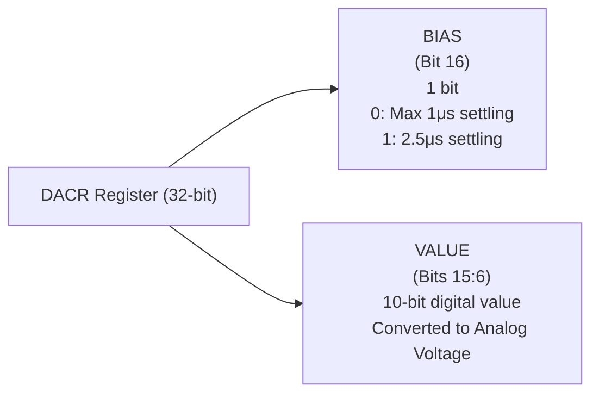

## LPC2148 DAC
#### LPC2148 DAC Features:
- **10-bit DAC**: The LPC2148 microcontroller comes equipped with a **10-bit DAC**, meaning it can represent digital values in the range of 0 to 1023 $(2^{10} - 1)$.
- **Resistor String Architecture**: The DAC in the LPC2148 is based on a **resistor string architecture**, ensuring stable and accurate analog conversion. (R2R اللي استخدمناها في بروجيكت اللوجيك)
- **Low-Power Mode**: The DAC continues to work even in **Power Down mode**, which helps save energy in low-power applications.
#### Key DAC Components and Pins:
The DAC in LPC2148 involves several important components and pins:
- **AOUT (Analog Output Pin)**: This is the pin where the analog voltage corresponding to the digital input is output. 
  - **Analog Voltage Calculation**: The analog output voltage on **AOUT** is calculated by the formula:
  $\text{Analog Output} = \left(\frac{\text{VALUE}}{1024}\right) \times \text{VREF}$
  - Example: If `VALUE = 512`, the output voltage is `VREF/2`.
- **VREF (Voltage Reference)**: This provides the reference voltage for the DAC, which determines the scale of the output voltage.
- **VDDA & VSSA (Analog Power and Ground)**: These pins supply power and ground for the DAC. They are similar to the VDD and VSS pins used for digital power supply and grounding.
### DAC Registers
#### DACR Register Overview

The **DACR** is a 32-bit register that allows us to set the digital value and configure the DAC's behavior. Here's a breakdown of the key bits in the **DACR** register:
- **Bits 15:6 – VALUE**: These bits hold the **10-bit digital value** (ranging from 0 to 1023) that we want to convert into an analog voltage.
  - The formula to calculate the analog output voltage is:  
    $\text{Analog Output} = \left(\frac{\text{VALUE}}{1024}\right) \times \text{VREF}$

- **Bit 16 – BIAS**: This bit controls the settling time and current of the DAC:
  - `0`: Maximum settling time of **1 µsec** and current of **700 µA**.
  - `1`: Settling time of **2.5 µsec** and current of **350 µA**.
  
- **Bits 31:17 – RESERVED**: These bits are not used and are reserved for future implementations. You should not modify these bits.
#### DACR Register Structure


#### How to Use the DACR Register?
To use the DAC effectively, you follow these steps:
1. **Set the DAC Output Pin**: First, configure the output pin (**P0.25**) using the **PINSEL Register** to use it for DAC output.
2. **Set the Settling Time (BIAS)**: Adjust the settling time by setting the **BIAS** bit in the **DACR Register**. This determines how quickly the output voltage stabilizes.
3. **Write the 10-bit VALUE**: Finally, write the **10-bit digital value** (VALUE) to the **DACR Register**. This value will be converted into an analog voltage according to the formula mentioned earlier.
#### DACR Register Example

Let’s say we want to output a value of 512. To do this, we need to write the following to the DACR register:

```c
DACR = (1 << 16) | (512 << 6);
```

Here’s what happens:
- `(1 << 16)`: This sets the **BIAS** bit to `1`, meaning a settling time of **2.5 µsec** and current of **350 µA**.
- `(512 << 6)`: This sets the **VALUE** field to `512`, which corresponds to half of the reference voltage (**VREF / 2**).
#### Summary of DACR Register Configuration:
| Field                | Description                                                      | Example Value         |
| -------------------- | ---------------------------------------------------------------- | --------------------- |
| **VALUE (15:6)**     | 10-bit digital value (0-1023) to be converted to analog voltage. | 512                   |
| **BIAS (bit 16)**    | Controls settling time and current: 0 for fast, 1 for slow.      | 1 (2.5 µsec settling) |

### Code Example
#### 1. **Initial Setup**
The code starts by configuring the necessary hardware:
- **PINSEL1** is used to configure **P0.25** as the DAC output pin.
- **IO0DIR** sets the direction of the input pins, which are used for selecting the waveform type through switches.
```c
PINSEL1 = 0x00080000;  /* P0.25 as DAC output */
IO0DIR = (IO0DIR & 0xFFFFF0FF);  /* Input pins for switches: P0.8 (sine), P0.9 (triangular), P0.10 (sawtooth), P0.11 (square) */
```
This setup ensures that **P0.25** will output the analog signal and the switches are configured as inputs.
#### 2. **Waveform Definitions**
In this part of the code, arrays for different waveforms are defined. For example, a **sine wave** (لو عندي اي شكل تاني بقى هحط قيمه كده برضو) is represented as an array of 42 values (since sine waves typically have multiple samples per period).
```c
uint16_t sin_wave[42] = {
    512, 591, 665, 742, 808, 873, 926, 968, 998, 1017, 1023, 1017, 998, 968, 926, 873, 808, 742, 665, 
    591, 512, 436, 359, 282, 216, 211, 151, 97, 55, 25, 6, 0, 6, 25, 55, 97, 151, 211, 216, 282, 359, 436
};
```
#### 3. **Waveform Generation Logic**
The `while` loop continuously checks which switch is pressed and generates the corresponding waveform:
- **Sine Wave**: When **P0.8** is pressed, the code iterates through the **sin wave** array and writes each value to the **DACR** register.
```c
if (!(IO0PIN & (1 << 8))) {  // If sine wave switch is pressed
    while (i != 42) {
        value = sin_wave[i];
        DACR = ((1 << 16) | (value << 6));  // Write value to DACR
        delay_ms(1);  // Delay to control frequency
        i++;
    }
    i = 0;  // Reset the counter for next sine wave cycle
}
```
- **Triangular Wave**: When **P0.9** is pressed, the code increments and decrements the **VALUE** from 0 to 1023, creating a triangular waveform.
```c
else if (!(IO0PIN & (1 << 9))) {  // If triangular wave switch is pressed
    value = 0;
    while (value != 1023) {
        DACR = ((1 << 16) | (value << 6));
        value++;  // Increment for upward slope
    }
    while (value != 0) {
        DACR = ((1 << 16) | (value << 6));
        value--;  // Decrement for downward slope
    }
}
```
- **Sawtooth Wave**: When **P0.10** is pressed, the code generates a sawtooth wave by continuously incrementing the value from 0 to 1023.
```c
else if (!(IO0PIN & (1 << 10))) {  // If sawtooth wave switch is pressed
    value = 0;
    while (value != 1023) {
        DACR = ((1 << 16) | (value << 6));
        value++;  // Continuous increment to create sawtooth
    }
}
```
- **Square Wave**: When **P0.11** is pressed, the code alternates between high (1023) and low (0) values to create a square wave.
```c
else if (!(IO0PIN & (1 << 11))) {  // If square wave switch is pressed
    value = 1023;
    DACR = ((1 << 16) | (value << 6));  // High state
    delay_ms(100);  // Delay for desired frequency
    value = 0;
    DACR = ((1 << 16) | (value << 6));  // Low state
    delay_ms(100);  // Delay for desired frequency
}
```
- **DC Voltage**: If no switch is pressed, a constant **DC voltage** is output (1023, which represents the reference voltage **VREF**).
```c
else {  // If no switch is pressed, output DC voltage
    value = 1023;
    DACR = ((1 << 16) | (value << 6));  // Constant DC voltage
}
```