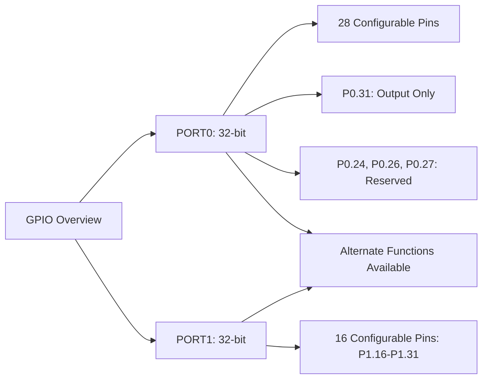
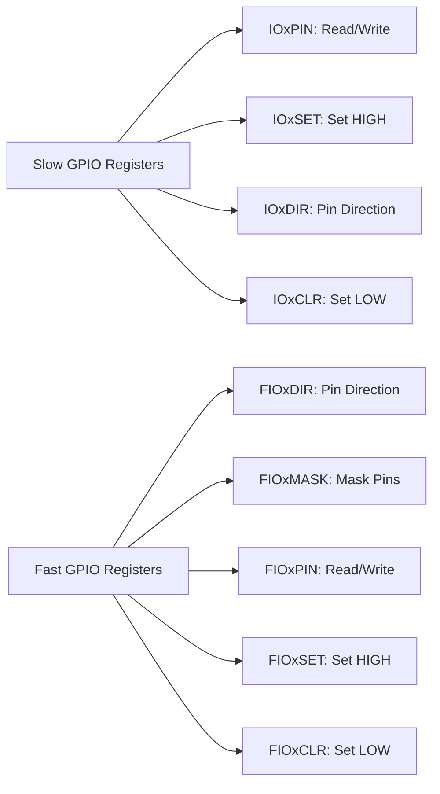

## Introduction to GPIOs

### What is GPIO?

- **GPIO** stands for **General-Purpose Input/Output**.
- GPIO pins can be dynamically configured as **input** or **output** during runtime.
- A group of GPIO pins is collectively referred to as a **port**.

### LPC2148 Microcontroller GPIO Overview

#### Key Features:

- Two 32-bit GPIO ports: **PORT0** and **PORT1**.

#### PORT0:

- **32-bit port**, but:
  - **28 pins** are configurable as general-purpose input/output.
  - **P0.31**: Can only function as an output pin.
  - **P0.24, P0.26, P0.27**: Reserved, not available for use.

#### PORT1:

- **32-bit port**, but:
  - Only **16 pins (P1.16 – P1.31)** are available as general-purpose input/output.

### Alternate Functions of GPIO Pins

- Many pins in **PORT0** and **PORT1** have alternate functions:
  - Example: **P0.0** can function as:
    - **TXD** (Transmit Data) for UART0
    - **PWM1** (Pulse Width Modulation)
- The alternate function is selected using **Pin Function Select Registers**.

### Note on External Resistors

- **PORT0 pins lack built-in pull-up or pull-down resistors.**
  - External resistors are required to ensure stable behavior and avoid floating states.

### LPC2148 GPIO Ports



## Registers

### Slow GPIO Registers

- **Legacy Compatibility**
  - `IOXPIN`: Read/Write pin values.
  - `IOXSET`: Set pins HIGH.
  - `IOXDIR`: Pin direction control.
  - `IOXCLR`: Set pins LOW.

#### Example Usage

```c
IO0DIR = 0x000000F0; // Configure P0.4-P0.7 as output and P0.0-P0.3 as input
IO0SET = (1 << 4);   // Set P0.4 HIGH
IO0CLR = (1 << 4);   // Set P0.4 LOW
```

### Fast GPIO Registers

- **Enhanced Performance** (3.5x faster access via ARM local bus).
  - `FIOXDIR`: Configure pin direction.
  - `FIOXMASK`: Mask pins for fast access.
  - `FIOXPIN`: Read/Write pin values.
  - `FIOXSET`: Set pins HIGH.
  - `FIOXCLR`: Set pins LOW.

#### Why "Fast GPIO"?

- Registers relocated to ARM local bus for quicker access, especially noticeable in assembly code.



## Example: LED Control Using a Button

### Objective

Control an **LED** connected to `P0.0` using a **button** connected to `P0.1`.

### Code Explanation

1. **Setup**:
   - Configure `P0.0` as output for LED.
   - Configure `P0.1` as input for button.
2. **Logic**:
   - Turn LED ON if the button is pressed.
   - Turn LED OFF otherwise.

#### Code Example

```c
#include <lpc214x.h>
#include <stdint.h>

int main(void) {
    PINSEL0 = 0x00000000; // Configure P0.0-P0.15 as GPIO
    IO0DIR = 0x00000001;  // P0.0 as output, P0.1 as input

    while (1) {
        if (IO0PIN & (1 << 1)) {  // If button (P0.1) is pressed
            IO0SET = 0x00000001;  // Turn LED ON (P0.0 HIGH)
        } else {                  // If button is not pressed
            IO0CLR = 0x00000001;  // Turn LED OFF (P0.0 LOW)
        }
    }
}
```

## LCD 16x2 Interfacing with LPC2148

### What is LCD 16x2?

- A commonly used **display module** in embedded systems.
- Features:
  - **16 pins** in total:
    - **Data Pins (D0-D7)**: Handle data communication.
    - **Control Pins**:
      - **RS (Register Select)**: Determines command or data mode.
      - **RW (Read/Write)**: Configures read or write operations.
      - **EN (Enable)**: Signals when data is ready to be read/written.
    - Other pins manage **power supply** and **backlighting**.

### Modes and Configuration

- **Command Mode**:
  - RS = 0, RW = 0: Send configuration commands (e.g., setting display properties).
- **Data Mode**:
  - RS = 1, RW = 0: Send actual data to display (e.g., characters).
- **Operating Modes**:
  - **4-bit mode**: Uses fewer data lines.
  - **8-bit mode**: Full data communication.

### Example Interfacing LCD with LPC2148

#### Pin Connections

- **Data Pins (D0-D7)**: Connected to `P0.8-P0.15` of PORT0.
- **Control Pins**:
  - **RS**: Connected to `P0.4`.
  - **RW**: Connected to `P0.5`.
  - **EN**: Connected to `P0.6`.

### LCD Programming

#### 1. Initialization

- Configure GPIO pins for **LCD data and control**.
- Send initialization commands to the LCD.

```c
void lcd_init(void) {
    IO0DIR = 0x0000FFF0;  // Configure P0.8-P0.15 as data lines, P0.4, P0.5, P0.6 as control lines
    delay_ms(20);         // Wait for LCD to power up
    lcd_command(0x38);    // Initialize in 8-bit mode
    lcd_command(0x0C);    // Display ON, Cursor OFF
    lcd_command(0x06);    // Auto-increment cursor
    lcd_command(0x01);    // Clear display
    lcd_command(0x80);    // Move cursor to first line, first position
}
```

#### 2. Command Write Function

- RS = 0, RW = 0: Send configuration commands.
- Generate enable pulse (high to low).

```c
void lcd_command(char command) {
    IO0PIN = (IO0PIN & 0xFFFF00FF) | (command << 8); // Send command to data pins
    IO0SET = 0x00000040;  // EN = 1
    IO0CLR = 0x00000030;  // RS = 0, RW = 0
    delay_ms(2);          // Wait for command execution
    IO0CLR = 0x00000040;  // EN = 0
    delay_ms(5);
}
```

#### 3. Data Write Function

- RS = 1, RW = 0: Send data to display characters.
- Generate enable pulse (high to low).

```c
void lcd_data(char data) {
    IO0PIN = (IO0PIN & 0xFFFF00FF) | (data << 8); // Send data to data pins
    IO0SET = 0x00000050;  // RS = 1, EN = 1
    IO0CLR = 0x00000020;  // RW = 0
    delay_ms(2);          // Wait for data execution
    IO0CLR = 0x00000040;  // EN = 0
    delay_ms(5);
}
```
