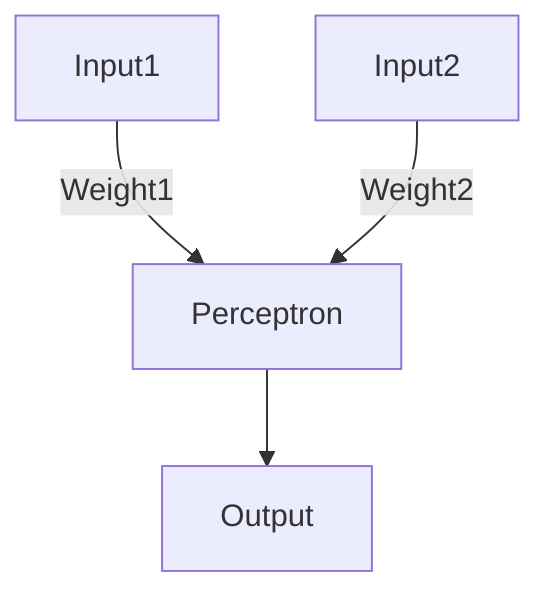
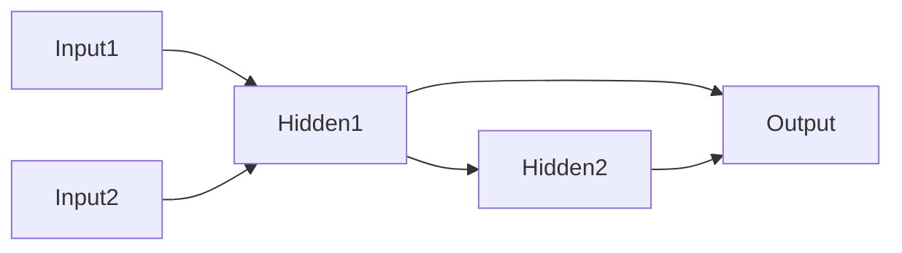

## Neural Networks

### Origins

- Neural networks (NNs) are algorithms designed to mimic the brain.
- Popular in the 1980s and early 1990s, but popularity waned in the late 1990s.
- Recent resurgence as a state-of-the-art technique in various applications.
- Artificial neural networks are far simpler than the brain’s structure.

---

### The Brain

- **Composition**: Networks of neurons.
- **Function**: Brain activity occurs due to neuron firing.
- **Neurons**:
    - Connect through synapses, propagating action potentials (electrical impulses).
    - Synapses release neurotransmitters, which can be:
        - **Excitatory**: Increase potential.
        - **Inhibitory**: Decrease potential.
    - **Learning**: Synapses exhibit plasticity, enabling long-term changes in connection strength.
- **Scale**:
    - ~10¹¹ neurons.
    - ~10¹⁴ synapses.

---

### Neural Networks and the Brain

- Neural networks consist of computational models of neurons called **perceptrons**.

#### The Perceptron

- A **threshold unit**:
    - Fires if the weighted sum of inputs exceeds a threshold.
    - Analogous to a threshold gate in Boolean circuits.

#### Soft Perceptron (Logistic)

- Replaces threshold with a **sigmoid activation function**.
    - A "squashing" function that produces a continuous output.

---

### Structure of Neural Networks

- Composed of **nodes (units)** connected by **links**.
    - Each link has a weight and activation level.
    - Each node has:
        - **Input function**: Summing weighted inputs.
        - **Activation function**: Transforms the input value.
        - **Output**.

#### Multi-Layer Perceptron

- **Feed-Forward Process**:
    1. Input layer units are activated by external stimuli (e.g., sensors).
    2. The input function computes input values by summing weighted activations.
    3. Activation function applies a non-linear transformation (e.g., sigmoid).
- **Inputs**: Real or Boolean.
- **Outputs**: Real or Boolean; can have multiple outputs per input.

---

### Summary

- Neural networks are inspired by biological neurons but are far less complex.
- Their structure and functionality involve input, activation, and output, mimicking a simplified version of brain processes.
- Feed-forward networks like multi-layer perceptrons are foundational to many applications.

## **Slides Ex.2**

![[{57AA0E11-4ADE-44F1-B78B-7B102A985792}.png]]
### **Error Function:**

$$\large E = \frac{1}{2}(y - out)^2$$

### **1. Gradients for Output Layer Weights ($W_5, W_6$):**

Let’s first compute the error gradient for $W_5$:

#### **Step 1: Compute $\frac{\partial E}{\partial out}$:**

$$\large \frac{\partial E}{\partial out} = -(y - out)$$

#### **Step 2: Derivative of output activation:**

For sigmoid:

$$\large out = f(z) = \frac{1}{1 + e^{-z}}$$$$\large f'(z) = out(1 - out)$$

$$\large z = h_1 W_5 + h_2 W_6 + b_3$$

$$\large \frac{\partial out}{\partial z} = out(1 - out)$$

#### **Step 3: Chain rule application:**

For $W_5$:

$$\large \frac{\partial E}{\partial W_5} = \frac{\partial E}{\partial out} \cdot \frac{\partial out}{\partial z} \cdot \frac{\partial z}{\partial W_5}$$

Now substituting values:

1. $\large \frac{\partial z}{\partial W_5} = h_1$
2. $\large \frac{\partial out}{\partial z} = out(1 - out)$

$$\large \frac{\partial E}{\partial W_5} = -(y - out)(out)(1 - out)(h_1)$$

Similarly, for $W_6$:

$$\large \frac{\partial E}{\partial W_6} = -(y - out)(out)(1 - out)(h_2)$$

---

### **2. Gradients for Hidden Layer Weights ($W_1, W_2, W_3, W_4$):**

#### For $W_1$ (connected to $h_1$):

We need to backpropagate through $h_1$:

$$\large \frac{\partial E}{\partial W_1} = \frac{\partial E}{\partial out} \cdot \frac{\partial out}{\partial z} \cdot \frac{\partial z}{\partial h_1} \cdot \frac{\partial h_1}{\partial z_1} \cdot \frac{\partial z_1}{\partial W_1}$$

Breaking it down:

1. From earlier:

$$\large \frac{\partial E}{\partial out} = -(y - out), \quad \frac{\partial out}{\partial z} = out(1 - out)$$

2. From hidden layer $h_1$:

$$\large \frac{\partial h_1}{\partial z_1} = h_1(1 - h_1)$$

3. Weight contribution:

$$\large \frac{\partial z_1}{\partial W_1} = X_1$$

Combining:

$$\large \frac{\partial E}{\partial W_1} = -(y - out)(out)(1 - out)(W_5)(h_1)(1 - h_1)(X_1)$$

Similarly, for $W_2$:

$$\large \frac{\partial E}{\partial W_2} = -(y - out)(out)(1 - out)(W_5)(h_1)(1 - h_1)(X_2)$$

---

### **3. Final Gradient Formulas:**

- **Output Layer:**

$$\large \frac{\partial E}{\partial W_5} = -(y - out)(out)(1 - out)(h_1)$$$$\large \frac{\partial E}{\partial W_6} = -(y - out)(out)(1 - out)(h_2)$$
- **Hidden Layer:**

$$\large \frac{\partial E}{\partial W_1} = -(y - out)(out)(1 - out)(W_5)(h_1)(1 - h_1)(X_1)$$$$\large \frac{\partial E}{\partial W_2} = -(y - out)(out)(1 - out)(W_5)(h_1)(1 - h_1)(X_2)$$$$\large \frac{\partial E}{\partial W_3} = -(y - out)(out)(1 - out)(W_6)(h_2)(1 - h_2)(X_1)$$$$\large \frac{\partial E}{\partial W_4} = -(y - out)(out)(1 - out)(W_6)(h_2)(1 - h_2)(X_2)$$
