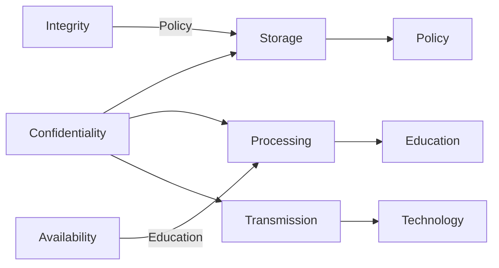

## Definitions and History

### What is Information Security?
- **Information Security (InfoSec)**: The practice of protecting information and its critical elements (systems, hardware, software) from unauthorized access, modification, or destruction.
- InfoSec incorporates **data security**, **network security**, and **information security management**.
### The Evolution of Computer Security
- **Early Beginnings**:
  - Computer security emerged post-WWII with the advent of mainframes.
  - Initial focus was on **physical security** and **document classification** to prevent equipment theft, espionage, and sabotage.
- **1960s**:
  - Cold War demands led to **more advanced mainframes** and the development of ARPANET by ARPA, laying the foundation for the modern Internet.
- **1970s-1980s**:
  - As ARPANET grew, vulnerabilities surfaced due to limited remote user controls.
  - **RAND Report R-609** expanded security concerns from physical protections to include data security, unauthorized access limitations, and management policies.
- **1990s**:
  - The Internet evolved into a global network, connecting multiple systems with minimal security measures.
  - Organizations began formalizing security efforts, making InfoSec an independent field.
- **2000 to Present**:
  - The Internet enabled widespread communication among unsecured networks.
  - The emergence of sophisticated cyber threats increased awareness of the need for robust security measures, from individual hackers to government-sponsored attacks.
- **MULTICS (Multiplexed Information and Computing Service)**: Early researches of computer security centered in it.
### Key Milestones in Information Security
- **1968**: Maurice Wilkes highlights password security concerns.
- **1970**: RAND Report R-609, authored by Willis H. Ware, addresses security controls for computer systems.
- **1978**: Federal standards examine the Digital Encryption Standard (DES).
- **1982**: Trusted Computer Security Evaluation Center publishes the Rainbow Series, influencing future security frameworks.
## Definitions
### What is Security?
- **Security**: Defined as a "state of being secure and free from danger or harm." Security involves actions taken to protect people, operations, infrastructure, information, and assets.
- Security requires **multiple layers of protections** across various domains, including physical, personal, operations, communications, and information.
### What is Information Security?
- **Information Security (InfoSec)**: Protects information and its critical elements—such as systems, hardware, and software—used for storage, processing, and transmission.
- **C.I.A. Triad**: A foundational model in InfoSec, representing three core principles:
  - **Confidentiality**: Ensures that information is accessible only to authorized individuals.
  - **Integrity**: Maintains the accuracy and reliability of data, preventing unauthorized alterations.
  - **Availability**: Guarantees that authorized users have timely and reliable access to information as needed.
## Key Concepts
### Fundamental Terms in Information Security
- **Access**: The ability of a subject (e.g., user) to interact with an object (e.g., data) by using, modifying, or viewing it.
- **Asset**: Any valuable resource, such as information or systems, requiring protection.
- **Attack**: An intentional or unintentional action that compromises the integrity, confidentiality, or availability of information or systems.
- **Control, Safeguard, or Countermeasure**: Mechanisms, policies, or processes designed to mitigate or prevent security threats, reduce risk, and address vulnerabilities.
- **Exploit**: A specific technique or code that leverages a vulnerability to compromise a system.
- **Exposure**: The condition of being open to potential loss or harm due to security vulnerabilities.
### Risk and Threat Terminology
- **Loss**: An occurrence where an information asset suffers unauthorized access, destruction, or modification, resulting in harm.
- **Protection Profile or Security Posture**: The comprehensive set of controls and safeguards used by an organization to protect its assets.
- **Risk**: The probability of an adverse event impacting assets, potentially causing harm or loss.
- **Threat**: Any potential danger that could exploit vulnerabilities in an asset.
- **Threat Agent**: The specific entity or source of a threat, such as a hacker or natural disaster.
- **Threat Event**: An incident in which a threat is realized, impacting the security of an asset.
- **Threat Source**: A category of entities (people, objects, systems) that represent a danger to assets.
- **Vulnerability**: A flaw or weakness in a system or security measure that exposes it to potential threats or harm.
## Critical Characteristics of Information
### Key Characteristics of Information
- **Confidentiality**: Prevents unauthorized access or disclosure of information.
- **Integrity**: Maintains the wholeness, accuracy, and reliability of information.
- **Availability**: Ensures information is accessible to authorized users when needed.
- **Accuracy**: Ensures information is free from errors and reliable.
- **Authenticity**: Verifies that information is genuine and original.
- **Utility**: Refers to the usefulness of information to an end-user.
- **Possession**: The state of having ownership or control over information.
### CNSS Security Model (McCumber Cube)

## Roles in Information Security

### Senior Management Roles
- **Chief Information Officer (CIO)**:
  - Senior technology executive responsible for advising top leadership on IT strategy.
  - Oversees management and strategic planning of information use across the organization.
- **Chief Information Security Officer (CISO)**:
  - Primarily responsible for assessing, managing, and implementing InfoSec measures within the organization.
  - Usually reports to the CIO and handles InfoSec policies, risk assessments, and compliance with security standards.
### Information Security Project Team
- **Champion**: A senior executive who sponsors the project, ensuring support and resources.
- **Team Leader**: A project manager or departmental head with knowledge of InfoSec, project management, and personnel management.
- **Security Policy Developers**: Individuals who craft effective security policies.
- **Risk Assessment Specialists**: Experts in financial risk, asset valuation, and security assessment techniques.
- **Security Professionals**: Specialized staff trained in technical and non-technical aspects of InfoSec.
- **Systems Administrators**: Personnel responsible for securing systems that house organizational data.
- **End Users**: Selected users contributing to practical, user-focused security implementations.
### Data Responsibilities
- **Data Owners**: Senior managers responsible for overall security and usage of specific data sets.
- **Data Custodians**: Guardians of data responsible for storage, maintenance, and adherence to security policies.
- **Data Trustees**: Coordinate with data custodians, ensuring secure management of data.
- **Data Users**: Employees with specific security responsibilities related to the information they access.
### Communities of Interest
- **Information Security Management and Professionals**
- **IT Management and Professionals**
- **Organizational Management and Professionals**
## Security Models and Implementation

| **Aspect**                             | **Bottom-Up Approach**                                                                             | **Top-Down Approach**                                                                                         |
|----------------------------------------|----------------------------------------------------------------------------------------------------|---------------------------------------------------------------------------------------------------------------|
| **Initiation**                         | Led by systems administrators and technical staff aiming to enhance specific system security.      | Initiated by senior management, focusing on organization-wide security with policies and procedures.          |
| **Key Advantage**                      | Leverages the technical expertise of individual administrators.                                    | Ensures organizational support and accountability; aligns security with strategic objectives.                 |
| **Limitations**                        | Often lacks formal policies, organizational support, and consistency for long-term effectiveness.  | Requires executive commitment and may involve complex planning, but achieves more sustainable results.       |
| **Implementation Structure**           | Decentralized, grassroots efforts that are more ad-hoc in nature.                                  | Follows a formal development framework, often incorporating the **Systems Development Life Cycle (SDLC)**.    |
| **Effectiveness**                      | Generally less effective for achieving comprehensive, organization-wide security.                  | Typically more effective, with management support ensuring sustained and aligned security measures.           |

### Balancing Information Security and Access
- **Security as a Process**: Perfect security is unattainable; it is an ongoing effort that requires balancing protection with accessibility.
- **Balancing Act**: Effective security implementation requires a balance between protection and access to prevent disruptions while maintaining security across systems and data.
## Information Security as Art, Science, and Social Science

| **Perspective**          | **Description**                                                                                                           |
|--------------------------|---------------------------------------------------------------------------------------------------------------------------|
| **Art**                  | Security involves intuition, creativity, and adaptability, with no single solution or strict rulebook.                    |
| **Science**              | Security relies on systematic, technical methods; nearly all actions in systems have predictable causes and effects.      |
| **Social Science**       | Security depends on understanding human behavior, as people are often the weakest link in security practices.             |

