## **Introduction to Risk Management**

Risk Management (RM) is the systematic process of identifying, assessing, and addressing risks to protect an organization’s information assets. Effective RM programs are vital for:

- **Maintaining Confidentiality and Integrity** of data.
- **Ensuring Availability** of systems and resources.
- Supporting organizational processes and governance structures.

### **Sun Tzu and Risk Management Philosophy**

> _"If you know the enemy and know yourself, you need not fear the result of a hundred battles." – Sun Tzu_

 

> _"في فرق بين اني اكتب جمله صعبه بتعبر عن معنى واحد كان ممكن اعبر عن نفس المعنى بجمله سهله (دي حاجه) وان انا اكتب جمله صعبه بتعبر عن كذا معنى مثلا 10 معاني فـ علشان اعبر عن الـ 10 معاني دول بجمل سهله فـ كنت هحتاج بدل الجمله الصعبه 10 جمل (دي حاجه تانيه)" – الجوكر_

 

- **Know Yourself**: Understand your assets and vulnerabilities.
- **Know the Enemy**: Recognize threats to your assets.

---
## **Key Definitions**

- **Risk**: Uncertainty impacting organizational goals.
- **Asset**: Valuable resources requiring protection.
- **Threat**: Events that may harm assets.
- **Vulnerability**: Weaknesses exploitable by threats.
- **Risk Consequence**: Potential losses due to risk.
- **Risk Likelihood**: Probability of a risk occurring.
- **Risk Impact**: Extent of damage caused by a risk.
- **Risk Level**: Derived from likelihood and impact.
- **Residual Risk**: Remaining risk after controls are applied.
- **Risk Appetite**: The amount of risk an organization is willing to accept.
- **Risk Tolerance**: Acceptable variations in risk levels.
### **Example**

|Element|Example|
|---|---|
|Asset|Server|
|Threat|Backdoor virus attack|
|Vulnerability|Outdated virus scanner|
|Likelihood|Medium|
|Impact|High (data integrity affected)|
|Risk Level|Moderate|

---

## **The Risk Management Framework**

RM involves a structured framework to systematically manage risks. It includes:

### **Key Questions Addressed by RM**

1. **Risk Identification** – What risks exist?
2. **Risk Analysis** – How severe are the risks?
3. **Risk Evaluation** – Are risks acceptable?
4. **Risk Treatment** – What actions reduce risks?

### **Framework Components**

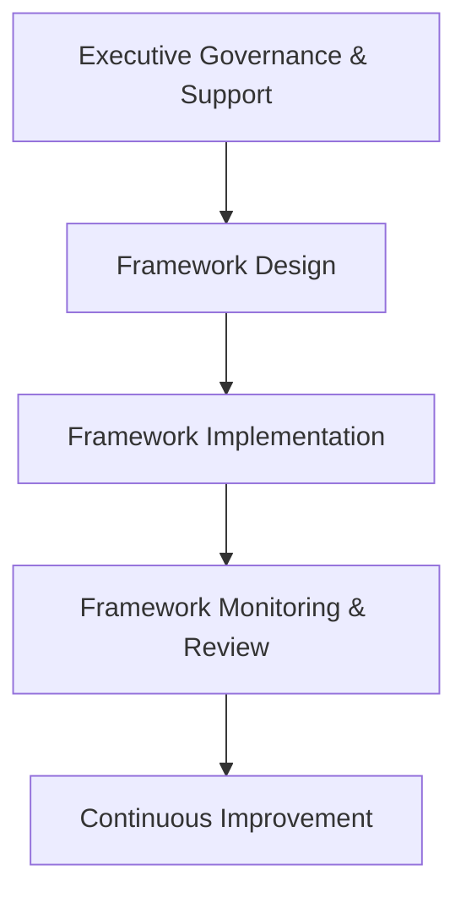

- **Governance & Support**: Sets policies and defines responsibilities.
- **Framework Design**: Establishes processes and defines risk appetite.
- **Implementation**: Executes the RM process with various approaches.
- **Monitoring & Review**: Ensures process effectiveness through evaluations.
- **Improvement**: Adjusts strategies based on results.

---

## **The Risk Management Policy**

The RM policy acts as a guiding document, converting governance directives into structured procedures for RM.
### **Policy Components**

- **Purpose and Scope**: Objectives and limits of RM.
- **Roles and Responsibilities**: Defines accountability.
- **Resource Requirements**: Tools and personnel.
- **Risk Appetite and Tolerances**: Acceptable risk levels.
- **Development Guidelines**: Steps for program creation.
- **References**: Links to other policies and standards.

---

## **Risk Management Process**

The risk management (RM) process is a structured approach to identify, analyze, evaluate, and treat risks within an organization. It operates within the RM framework to ensure effective execution.

### **Key Steps in the RM Process**

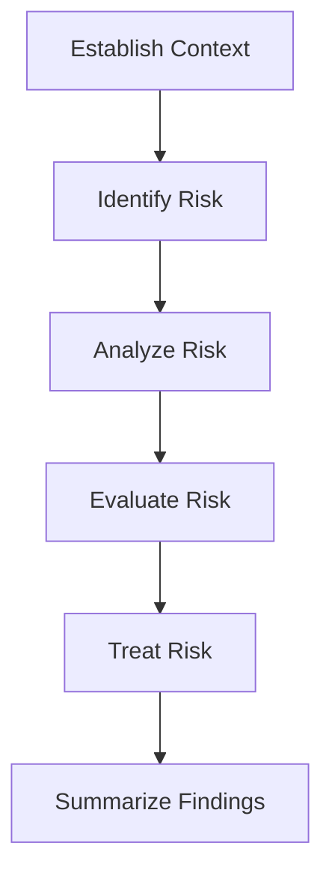

1. **Establish Context** – Define scope, objectives, and constraints.
2. **Identify Risk** – List and categorize assets, threats, and vulnerabilities.
3. **Analyze Risk** – Assess likelihood and impact.
4. **Evaluate Risk** – Compare risks against appetite and tolerances.
5. **Treat Risk** – Develop and implement controls.
6. **Summarize Findings** – Document results and recommendations.

---

### 1. **Establishing Context**

This preparatory step aligns RM efforts with organizational goals by:

- Identifying the **purpose** and **scope** of the assessment.
- Clarifying **assumptions** and **constraints**.
- Establishing sources of information.
- Selecting appropriate risk models and analytic approaches (e.g., NIST SP 800-30).

---

### 2. **Risk Identification**

Focuses on recognizing, categorizing, and documenting risks.
#### **Key Tasks**

1. **Identify Assets** – Evaluate internal and external assets:
	- **People**: Employees and contractors.
	- **Procedures**: IT and business processes.
	- **Data**: Storage, transmission, and processing.
	- **Hardware & Software**: Systems, devices, and applications.
	- **Networking**: LAN, cloud, and internet components.
1. **Identify Threats** – Examples include:
    - **Human errors**, **natural disasters**, **malware**, **espionage**, and **theft**.
3. **Identify Vulnerabilities** – Weaknesses exploitable by threats:
    - **Hardware failures**, **unpatched software**, or **inadequate controls**.
#### **Assessing the Value of Information Assets**

Assigning relative values to assets helps prioritize risk management efforts. Evaluation criteria include:

- **Criticality** to organizational success.
- **Revenue generation** and **profitability**.
- **Replacement cost**.
- **Embarrassment or liability** in case of compromise.
##### **Sample Classification Table**

|Asset|Classification|Impact|
|---|---|---|
|Customer Orders (SSL)|Confidential|Critical|
|Logistics Documents (EDI)|Confidential|High|
|Supplier Orders (EDI)|Confidential|Medium|
|Customer Service Requests (Email)|Private|Medium|

#### **Prioritizing Information Assets**

Once assets are classified, they are prioritized based on weighted criteria, such as:
- Revenue impact.
- Profitability.
- Reputation impact.
##### **Weighted Analysis Example**

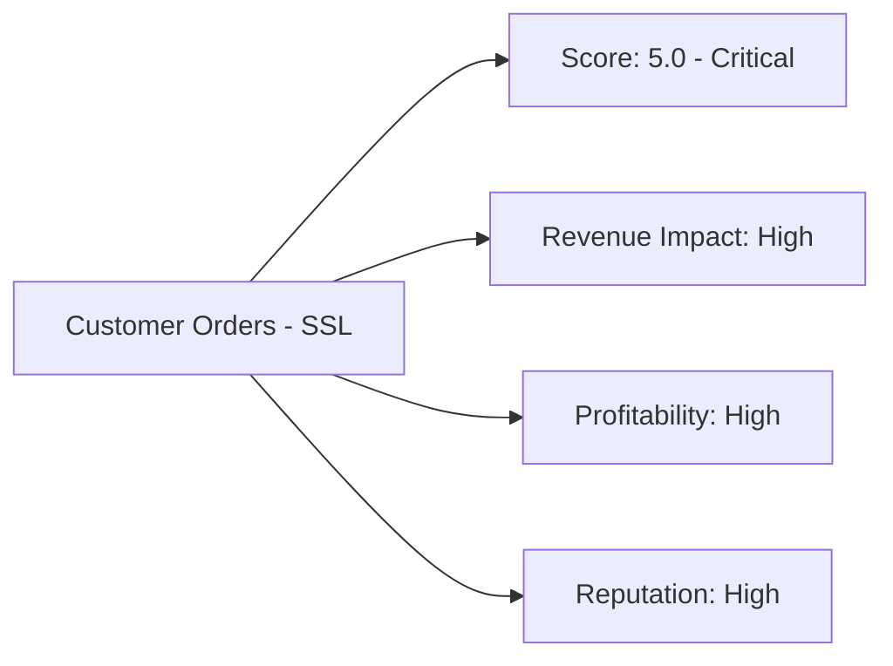
#### **Threat Assessment**
Realistic threats are evaluated using weighted tables to determine:
- **Danger level**.
- **Likelihood of occurrence**.
- **Probability of success**.
- **Cost of protection vs recovery**.
#### **Threat Categories**
- **Human Error**: Misconfiguration, mistakes.
- **Natural Disasters**: Fire, flood, earthquake.
- **Malware Attacks**: Viruses, worms, DoS.
- **Hardware/Software Failures**: System malfunctions.
- **Unauthorized Access**: Espionage, hacking.
#### **Vulnerability Assessment**
Examines weaknesses that can be exploited by threats, often using brainstorming sessions.
##### **Example for a DMZ Router**

|Threat|Vulnerability|Impact|
|---|---|---|
|Unauthorized Access|Weak firewall rules|High|
|Malware Injection|Outdated firmware|Medium|
|Power Failures|No backup power supply|Moderate|
|Denial-of-Service (DoS)|Open ports and lack of filtering|High|
#### **Threats-Vulnerabilities-Assets (TVA) Worksheet**
A TVA worksheet prioritizes the relationship between threats, vulnerabilities, and assets. It allows the creation of risk profiles and rankings for targeted risk management strategies.
##### **Example TVA Mapping**

| Asset                       | Threat                         | Vulnerability          | Priority |
| --------------------------- | ------------------------------ | ---------------------- | -------- |
| Customer Order System (SSL) | Unauthorized Access (Hacking)  | Weak Password Policies | High     |
| Logistics Documents (EDI)   | Malware Infection              | Unpatched Software     | Medium   |
| DMZ Router                  | Denial-of-Service Attack (DoS) | Lack of Filtering      | High     |

---
### 3. **Risk Analysis**

Risk analysis assesses vulnerabilities identified in previous steps to measure their impact and likelihood, assigning risk ratings to prioritize treatment strategies. It evaluates:
- The **severity** of vulnerabilities.
- The **probability** of exploitation.
- The **effectiveness** of existing controls.
#### **Key Objectives of Risk Analysis**

- Develop a **repeatable method** to evaluate vulnerabilities.
- Quantify **risk ratings** for prioritization.
- Distinguish between **controlled** and **uncontrolled risks**.
#### **Risk Formula**

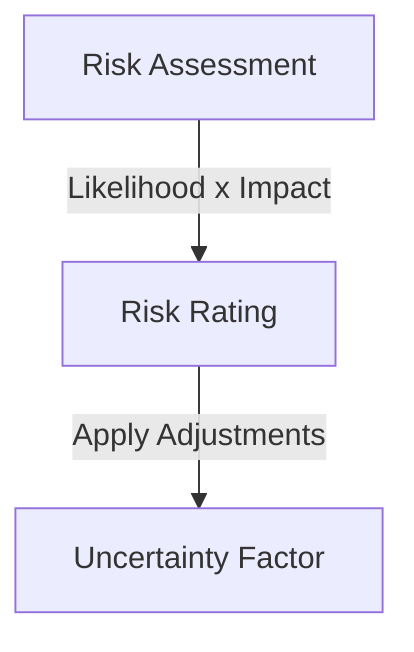

$$
\text{Risk} = \text{Likelihood} \times \text{Impact} \pm \text{Uncertainty Factor}
$$
#### **Likelihood Assessment**

Likelihood measures the probability of a threat exploiting a vulnerability.
##### **Likelihood Scale**

| Level              | Probability (%) | Frequency Example        |
| ------------------ | --------------- | ------------------------ |
| 0 - Not Applicable | 0%              | Will never happen.       |
| 1 - Rare           | 5%              | Once every 20 years.     |
| 2 - Unlikely       | 25%             | Once every 10 years.     |
| 3 - Moderate       | 50%             | Once every 5 years.      |
| 4 - Likely         | 75%             | Once a year.             |
| 5 - Almost Certain | 100%            | Multiple times per year. |

#### **Impact Assessment**

Impact evaluates the consequences of a successful attack on an asset.

##### **Impact Levels**

|Level|Description|Examples|
|---|---|---|
|0 - None|No impact.|No productivity loss or financial damage.|
|1 - Insignificant|Minimal disruption, no data exposure.|Few seconds of downtime.|
|2 - Minor|Short disruption, no data loss.|Multi-minute outages costing $20,000.|
|3 - Moderate|Hours of disruption, minor data exposure.|4-hour outage, data loss, $175,000 damage.|
|4 - Major|Full-day outage, data breaches.|8-hour downtime, $2 million loss.|
|5 - Severe|Prolonged outages, major data compromises.|Multi-day outage, $20 million+ losses.|

#### **Risk Aggregation and Uncertainty**
- Risks may be **aggregated** into broader categories for simpler evaluation.
- **Uncertainty Factors** account for incomplete information about vulnerabilities or effectiveness of controls.
- Managers use **experience and judgment** to address gaps in data.

#### **Risk Determination Process**

1. Assess **Likelihood** of exploitation.
2. Evaluate **Impact** based on consequences.
3. Calculate **Risk Scores** using the formula.
4. Compare results with the organization’s **Risk Appetite**.
5. Document results in risk rating worksheets.
##### **Example Worksheet**

|Asset|Vulnerability|Likelihood|Impact|Risk Score|
|---|---|---|---|---|
|Customer Orders (SSL)|Weak password policies|4|5|20|
|Logistics Documents (EDI)|Unpatched software|3|4|12|
|DMZ Router|DoS vulnerability|5|5|25|

---

### 4. **Risk Evaluation**

Using likelihood and impact assessments, risks are prioritized for treatment based on calculated scores.
#### **Risk Rating Matrix**

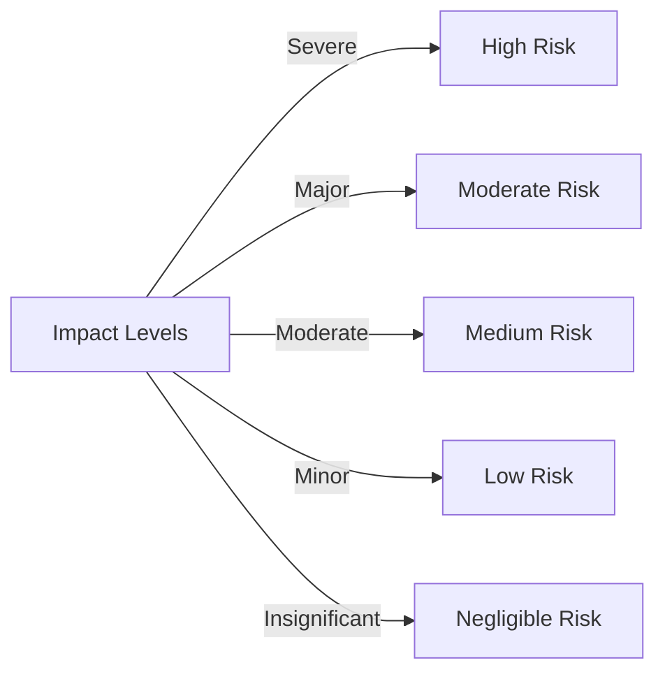
#### **Documenting Results**

Final results are summarized to support decision-making for risk treatment strategies.

##### **Risk Assessment Deliverables**

|Document|Purpose|
|---|---|
|**Asset Classification Worksheet**|Categorizes and ranks assets based on criticality and value.|
|**Threat Severity Table**|Ranks threats based on impact and probability.|
|**TVA Controls Worksheet**|Maps assets, threats, and vulnerabilities for analysis.|
|**Risk Rating Worksheet**|Prioritizes risks based on likelihood, impact, and uncertainty.|

---

### 5. **Risk Treatment**

Risk treatment, also known as **risk response** or **risk control**, involves addressing risks deemed unacceptable after evaluation. The goal is to mitigate risks to acceptable levels, aligning with the organization's **risk appetite**.

#### **Risk Treatment Approaches**

Organizations can adopt one of four strategies to treat risks:
##### **1. Mitigation (Risk Reduction)**

- **Purpose**: Minimize vulnerabilities and prevent exploitation.
- **Methods**:
    - Implement security controls and safeguards.
    - Update systems, patches, and antivirus programs.
    - Limit access and add physical or technical barriers.
-	Mitigation focuses on preventing vulnerabilities by:
	- **Reducing Likelihood**: Strengthen defenses, apply patches, and limit access.
	- **Minimizing Impact**: Backups, disaster recovery plans, and redundancy.
- **Example**: Enforcing strong password policies to reduce unauthorized access.
##### **2. Transference (Risk Sharing)**

- **Purpose**: Shift risk to a third party.
- **Methods**:
    - Outsource operations (e.g., cloud storage providers).
    - Purchase insurance policies.
    - Implement service level agreements (SLAs).
- **Contracts**: Establish clear terms in SLAs to ensure third-party accountability.
- **Insurance Policies**: Transfer financial risks to insurers.
- **Example**: Contracting a managed security service provider (MSSP) for monitoring.
##### **3. Acceptance**

- **Purpose**: Tolerate risk when mitigation costs exceed benefits.
- **Requirements**:
    - Assess potential impact and probability.
    - Evaluate existing controls.
    - Conduct thorough cost-benefit analysis.
- Suitable for low-impact, low-likelihood risks.
- Documented acknowledgment of risks.
- **Example**: Allowing minimal risk of downtime for non-critical systems.
##### **4. Termination (Risk Avoidance)**

- **Purpose**: Eliminate risk by discontinuing risky activities or assets.
- **Methods**:
    - Decommission systems.
    - Remove services from networks.
- Often used when the cost of mitigation is too high.
- Remove the asset from the environment.
- **Example**: Retiring an outdated application vulnerable to attacks.

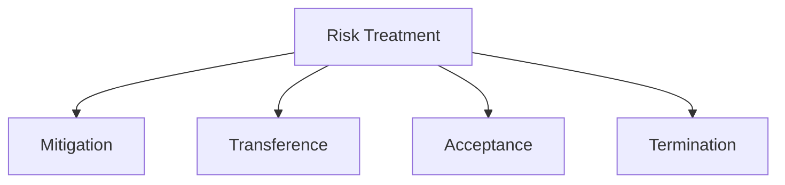

#### **Feasibility and Cost-Benefit Analysis (CBA)**

Before implementing treatments, organizations must weigh costs and benefits.
##### **Factors Affecting Costs**
- Development, acquisition, and deployment.
- Training and maintenance.
- Operational disruptions during implementation.
##### **Cost-Benefit Formula**

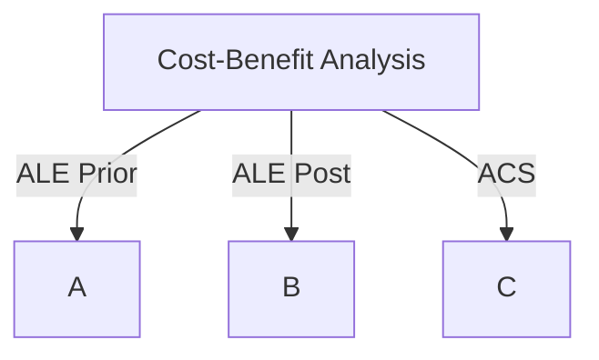

**CBA = ALE(prior) - ALE(post) - ACS**
- **ALE (Annualized Loss Expectancy)** measures expected losses.
- **ACS (Annualized Cost of Safeguard)** measures treatment cost.
##### **Asset Valuation**

Evaluates the worth of assets to determine the value of protection strategies.
###### **Key Components**
- **Replacement Costs**: Hardware/software replacement expenses.
- **Operational Costs**: Maintenance and security management.
- **Revenue Loss**: Downtime impact on profitability.
- **Liability Costs**: Legal and compliance risks.
###### **Formulas for Asset Valuation**

1. **Single Loss Expectancy (SLE)**:
    - SLE = Asset Value × Exposure Factor (EF)
2. **Annualized Loss Expectancy (ALE)**:
    - ALE = SLE × Annualized Rate of Occurrence (ARO)

---
## **Alternate Risk Management Methodologies**

Alternate risk management (RM) methodologies provide structured frameworks to identify, assess, and manage risks effectively. These methods vary based on organizational size, complexity, and focus areas.
### **Key RM Methodologies**

#### **1. OCTAVE (Operationally Critical Threat, Asset, and Vulnerability Evaluation)**

- Developed by Carnegie Mellon University.
- Variants:
    - **OCTAVE** - For large organizations.
    - **OCTAVE-S** - Simplified for smaller organizations.
    - **OCTAVE-Allegro** - Focuses on streamlined security assessments.
- Strengths: Asset-focused and operational risk prioritization.

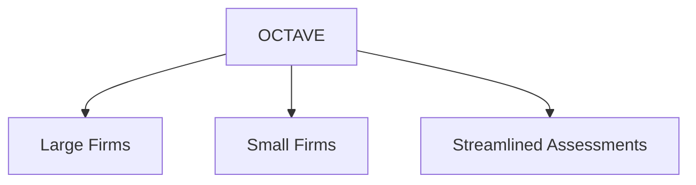
#### **2. FAIR (Factor Analysis of Information Risk)**

- Quantifies risk in **monetary terms**.
- Adopted as **Open FAIR™**, used by **RiskLens** tools.
- Focuses on **financial impact** for cost-benefit analysis.

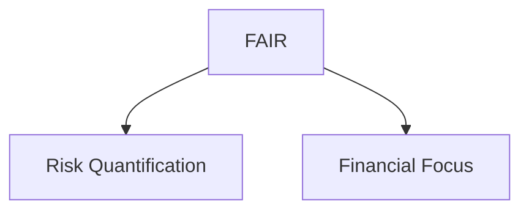

#### **3. ISO Standards**

- **ISO 27005** - Focuses on **information security risk management**.
- **ISO 31000** - Provides general **risk management principles**.
- Benefits: Ensures **compliance** and structured governance.

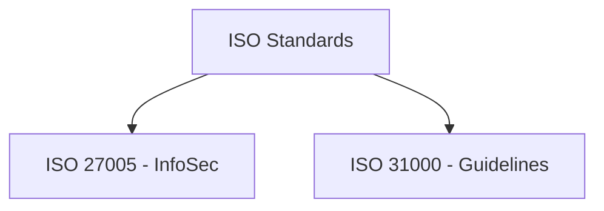

#### **4. NIST RMF (Risk Management Framework)**

- Focuses on **flexibility and iterative processes**.
- Documents:
    - **SP 800-37** - System-level RM.
    - **SP 800-39** - Organization-wide RM.
- Supports continuous **monitoring and improvement**.

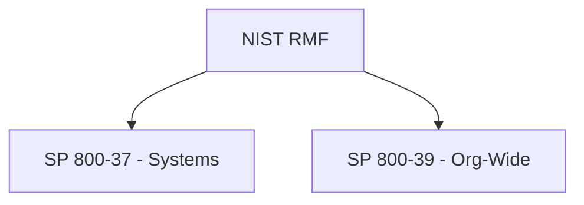

### **Choosing the Best RM Model**

- **OCTAVE** – Best for complex infrastructures.
- **FAIR** – Ideal for financial risk assessments.
- **ISO/NIST** – Suitable for compliance and governance.
#### **Key Considerations**
- Evaluate organizational needs and risk appetite.
- Test frameworks using **pilot programs**.
- Seek expert consultations and customize methods if needed.
