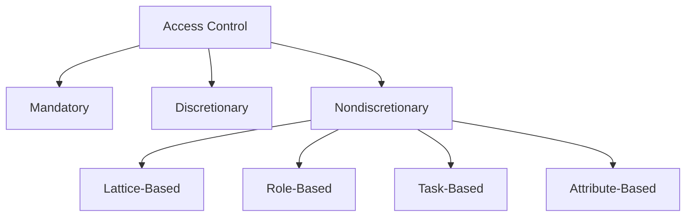
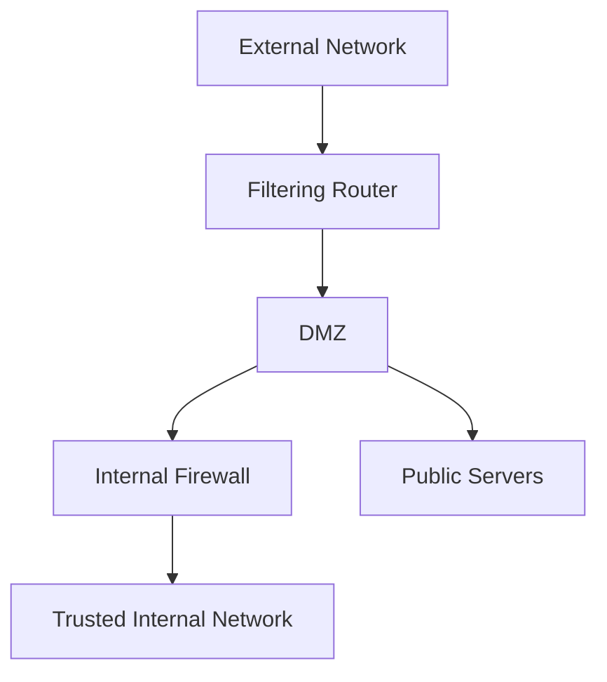
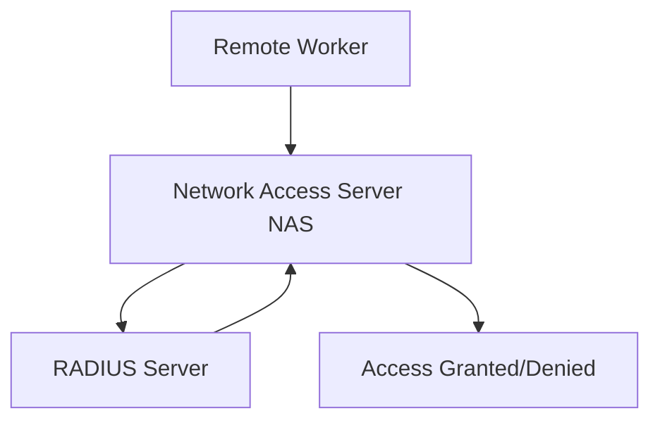

## Introduction to Access Controls

Access controls are fundamental mechanisms in information security that govern **permissions and privileges** for accessing resources. The implementation of these controls is vital for:

- **Balancing availability** and preserving the **confidentiality and integrity** of information.
- Managing the relationship between **subjects** (users or systems) and **objects** (resources).
- Defining _if, when, where_, and _how_ a subject may access an object.
## Access Controls

Access controls selectively allow or deny the use of resources. Different types of access controls include:
### Categories:
1. **Mandatory Access Controls (MACs):**
	- Structured data classification schemes.
	- Requires information and users to be rated and classified.
	- Enforced strictly by systems, offering little flexibility.
2. **Discretionary Access Controls (DACs):**
    - Implemented based on user discretion.
    - Users manage access to resources they own.
3. **Nondiscretionary Access Controls:**
    - Centralized enforcement by authority.
    - Subcategories of Nondiscretionary Controls:
	    - **Lattice-Based Access Control (LBAC):** Assigns users a matrix of permissions.
	    - **Role-Based Access Control (RBAC):** Relates access permissions to user roles within an organization.
	    - **Task-Based Access Control (TBAC):** Tied to specific tasks or responsibilities.
	    - **Attribute-Based Access Control (ABAC):** Uses user or system attributes to define access permissions.

---
### Core Mechanisms:
All access control systems share these four essential functions:
- 1. **Identification**:
	- Confirms the user's identity, Ex: a user enters their unique username to log into a system.
- 2. **Authentication**:
	- Validates the user's credentials, Ex: after entering a username, the user provides a password or biometric scan to verify their identity.
- 3. **Authorization**:
	- Specifies user permissions, Ex: a verified user can access shared files but cannot modify system settings.
- 4. **Accountability**:
	- Tracks and logs user activities, Ex: system logs record the time and actions of a user accessing sensitive data.



---
## Biometric Authentication
Biometric authentication employs **human physiological and behavioral traits** to verify identity.
### Unique Features:
- **Truly Unique Biometrics:**
    - Fingerprints
    - Retina and iris patterns
    - DNA
- Evaluated based on:
    - **False Reject Rate (FRR):** Genuine users incorrectly denied access.
    - **False Accept Rate (FAR):** Unauthorized users granted access.
    - **Crossover Error Rate (CER):** Balance between FRR and FAR.
### Effectiveness and Acceptance Matrix
The selection of biometric methods depends on factors such as:
- **Universality**: How common the trait is among users.
- **Uniqueness**: Distinctiveness of the trait.
- **Collectability**: Ease of data collection.
- **Acceptability**: User comfort and willingness.
- **Circumvention**: Difficulty in spoofing.

---
## Firewall Technologies

Firewalls are a combination of **hardware and software** designed to filter and control the flow of information between trusted and untrusted networks. They play a critical role in preventing unauthorized access and maintaining network security.
- Operate as a barrier between the **internal trusted network** and the **external untrusted network**.
- Can be implemented as:
    - Standalone systems.
    - Software services on routers or servers.
    - Dedicated networks with supporting devices.
## Firewall Processing Modes

Firewalls utilize various methods to inspect and manage network traffic, ensuring secure communication and access control. Here are the primary modes of operation:
### 1. Packet Filtering
- **Description:** Examines packet headers for source/destination IPs, ports, and protocol.
- **Decision Basis:** Rules are defined to allow or block traffic.
- **Types:**
    - **Static Filtering:** Predefined rules; requires manual updates.
    - **Dynamic Filtering:** Adjusts rules based on network events.
    - **Stateful Inspection:** Tracks active connections using a state table.
- **Example:** Blocking all incoming traffic to port 22 (SSH).
#### State Table:

<div dir="rtl"> 

بيفضل مسجل كل الـ active connection اللي سمحت بيها already وبناء على كده بقرر هعدي الـ packet ولا لا 

</div> 

|Source Address|Source Port|Destination Address|Destination Port|Time Remaining|Protocol|
|---|---|---|---|---|---|
|192.168.1.2|1024|10.0.0.1|80|3600|TCP|

### 2. Application-Layer Proxy
- **Description:** A device capable of functioning both as a firewall and an application layer proxy server.
- **Benefits:** Provides deep inspection and caching for performance.
- **Drawbacks:** May introduce latency and is vulnerable when placed in untrusted zones.
- **Example:** A proxy server restricting access to certain websites.
### 3. MAC Layer Firewalls
- **Description:** Operate at the data link layer, filtering based on MAC addresses.
- **Use Case:** Restrict traffic from specific, unauthorized devices.
- **Example:** Blocking access for devices not registered in an enterprise network.
### 4. Hybrid Firewalls
- **Description:** Combines features of multiple firewall types (e.g., stateful inspection + proxy).
- **Benefits:**
    - Enhanced flexibility.
    - Simplifies upgrades and system enhancements.
- **Example:** A hybrid firewall combining application-layer filtering with dynamic packet inspection.
## Firewall Architectures
Firewalls can be deployed in various architectures, with the choice depending on the **objectives, organizational capabilities**, and **budget**. These architectures define how firewalls are integrated into the network to provide layered security.
### Common Firewall Architectures:
1. **Single Bastion Host:**
    - A standalone firewall placed at the network perimeter.
    - Often implemented as a **dual-homed host** with two network interface cards (NICs): one for internal and one for external networks.
    - May use **Network Address Translation (NAT)** for additional protection.
    **Advantages:**
    - Simple and cost-effective for small networks.
    **Disadvantages:**
    - A single point of failure.
2. **Screened Host Architecture:**
    - Combines a **packet-filtering router** with a dedicated firewall (e.g., an application proxy server).
    - Router prescreens traffic before it reaches the firewall, reducing load.
    - Requires attackers to compromise two separate systems to breach the internal network.
3. **Screened Subnet Architecture (with DMZ):**
    - Dominant architecture for modern networks.
    - Utilizes multiple firewalls and routers to create a **demilitarized zone (DMZ)**.
    - External connections are routed through the filtering router to the DMZ.
    - Internal network access is allowed only via trusted DMZ hosts.
    **Advantages:**
    - Segregates public-facing services from sensitive internal systems.
    - Adds multiple layers of defense.
    **Visualization:**

### Benefits of DMZ:
- Protects DMZ systems from external threats.
- Limits exposure of internal networks.
- Enables **extranet creation** for partners and vendors.
## Selecting the Right Firewall
When choosing a firewall, several factors must be considered to balance **protection, functionality**, and **cost**:
-  Considerations:
	1. **Technology and Features**
	2. **Ease of Configuration**
	3. **Scalability**
	4. **Performance vs. Security**
	5. **Cost**
- Best Practices:
	- Ensure firewalls provide necessary protection without unnecessary complexity.
	- Keep a detailed **firewall policy** and update it regularly.
	- Regularly monitor and audit firewall logs to identify anomalies.
## Content Filtering
Content filters are used to control the type of data entering or leaving a network. They are often deployed to restrict access to non-business-related material or to block spam and malicious content.
## Protecting Remote Connections
With the increasing need for remote work and external access, securing remote connections has become essential. Organizations must safeguard both the connection medium and the methods used to authenticate and authorize remote users.
### Considerations for Remote Connections:
1. **Leased Lines and Data Channels:**
    - Dedicated data connections are often secured under formal agreements.
2. **Flexible Remote Access:**
    - Virtual Private Networks (VPNs) and similar mechanisms are widely used.
3. **Risks of Unsecured Dial-Up Connections:**
    - These represent significant vulnerabilities.
    - **War Dialers:** Automated tools used by attackers to locate and exploit dial-up entry points.
### Technologies to Secure Remote Connections:
1. **Authentication Systems:**
    - Examples include **Kerberos**, **RADIUS**, **TACACS**, and **CHAP password systems.**
    - These improve authentication processes and ensure secure identity verification.
2. **Audit Trails:**
    - Logs and monitoring ensure accountability and track unauthorized access attempts.

---
### RADIUS, Diameter, and TACACS
These are specialized systems for authenticating users accessing networks remotely, typically over dial-up or VPN connections.
#### Key Technologies:
1. **Remote Authentication Dial-In User Service (RADIUS):**
    - Centralizes user authentication.
    - **Example Flow:**
        - Remote worker submits credentials to a Network Access Server (NAS).
        - NAS sends the credentials to a central RADIUS server.
        - RADIUS server approves or denies access based on credentials.
    

2. **Diameter:**
 - Enhanced successor to RADIUS.
 - Provides better scalability and security features.
3. **TACACS (Terminal Access Controller Access-Control System):**
 - Centralized user authentication.
 - Client/server configuration for managing credentials.

---
### Kerberos
Kerberos provides secure third-party authentication using symmetric key encryption. It authenticates users to network resources without exposing sensitive credentials.
#### Key Components:
1. **Authentication Server (AS):** Verifies user credentials.
2. **Key Distribution Center (KDC):** Manages cryptographic keys.
3. **Ticket Granting Service (TGS):** Issues session tickets for authenticated users.
#### Workflow:
1. User logs in and sends a request to the AS.
2. AS returns an encrypted **Ticket Granting Ticket (TGT).**
3. User presents the TGT to the TGS to request access to a resource.
4. TGS provides a session ticket for resource access.

```mermaid
graph TD
A[User Logs In] --> B["Authentication Server (AS)"]
B --> C["Ticket Granting Ticket (TGT)"]
C --> D["Ticket Granting Service (TGS)"]
D --> E[Access Resource]
````

---
### Virtual Private Networks (VPNs)
VPNs create secure, encrypted connections over public networks, enabling safe data exchange between remote users and internal systems.
#### Types of VPNs:
1. **Trusted VPNs:**
    - Use dedicated leased lines or circuits.
2. **Secure VPNs:**
    - Employ encryption and tunneling protocols to secure communication.
3. **Hybrid VPNs:**
    - Combine features of trusted and secure VPNs.
#### Essential Features of VPNs:
1. **Encapsulation:**
    - Wrapping data packets for secure transmission.
2. **Encryption:**
    - Secures data during transit to prevent interception.
3. **Authentication:**
    - Verifies the identity of remote users and systems.
#### Transport Mode VPNs
- Encrypts only the data portion of packets; header information remains unencrypted.
- Direct connection between remote users and internal systems.
##### Use Cases:
1. **End-to-End Data Transport:**
    - Secure communication between two endpoints.
2. **Remote Access:**
    - Remote workers connect to office networks securely via VPN servers.
```mermaid
graph TD
  A[Remote Client] -->|Encrypted Data| B[VPN Server]
  B -->|Unencrypted Header| C[Destination System]
```
#### Tunnel Mode VPNs
- Encrypts the entire data packet, including headers.
- Requires two tunnel endpoints to establish secure communication.
##### Advantages:
- Greater security as the entire packet is encrypted.
- Conceals true destination from potential attackers.
