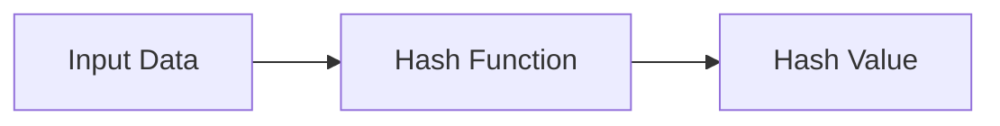
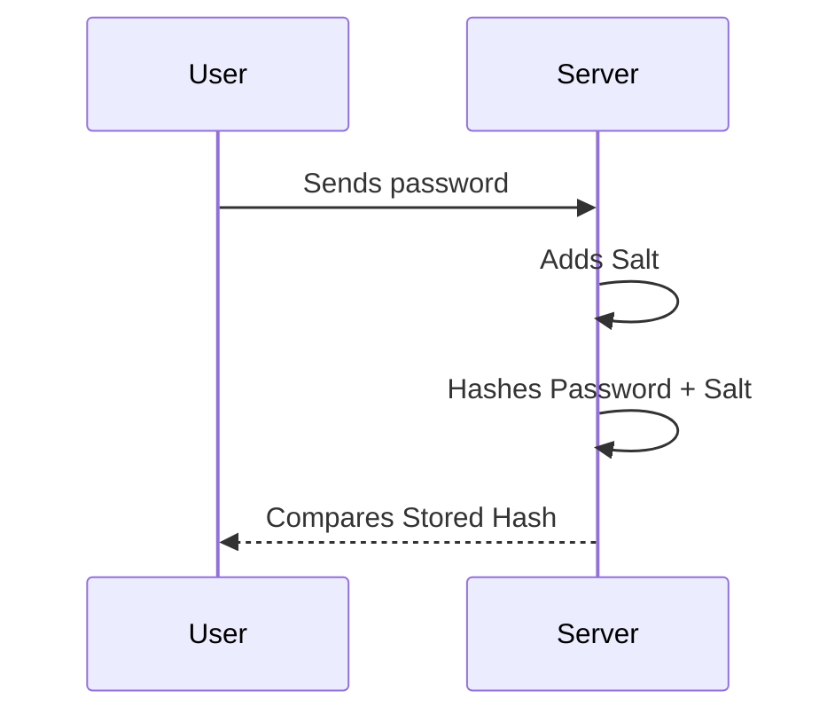
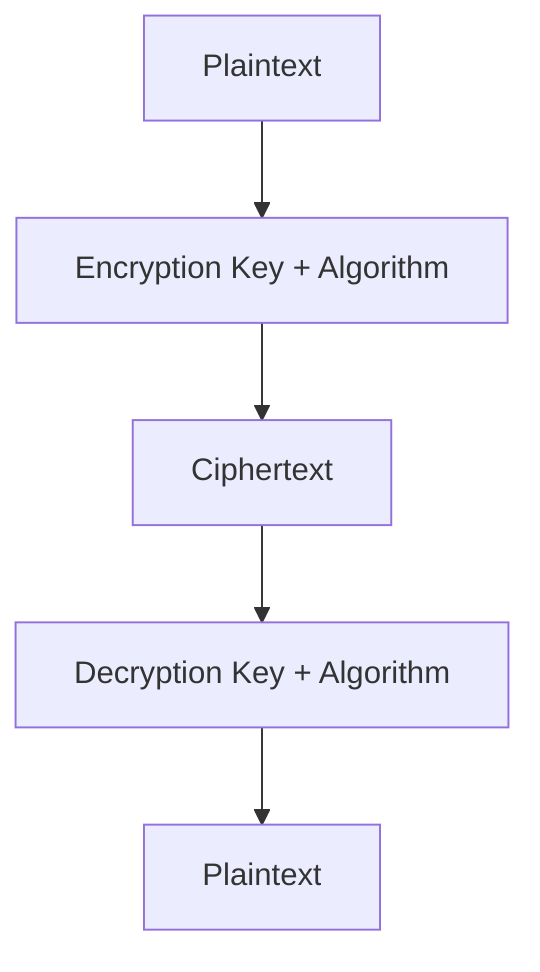
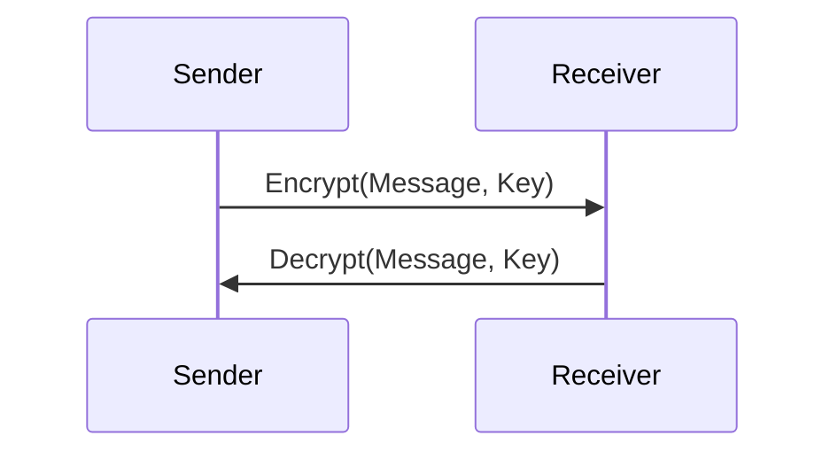
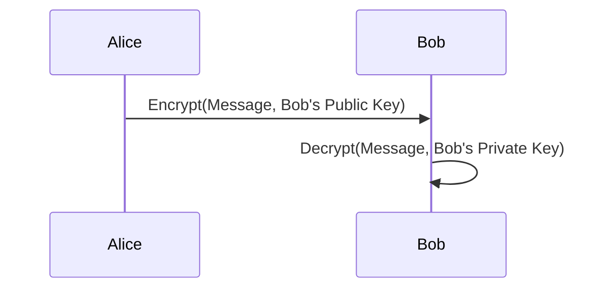
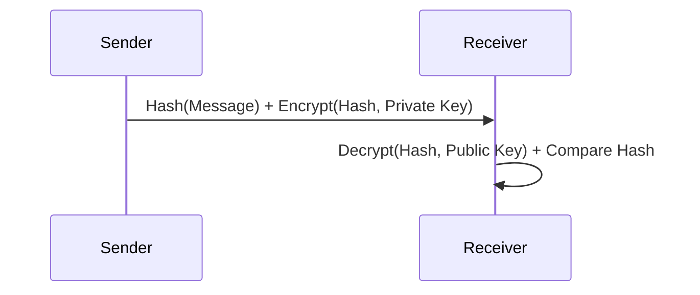
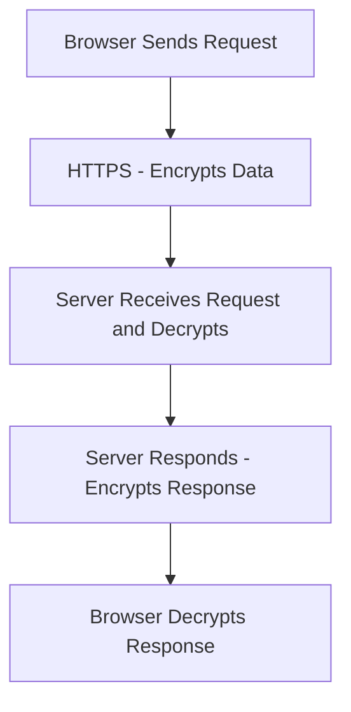
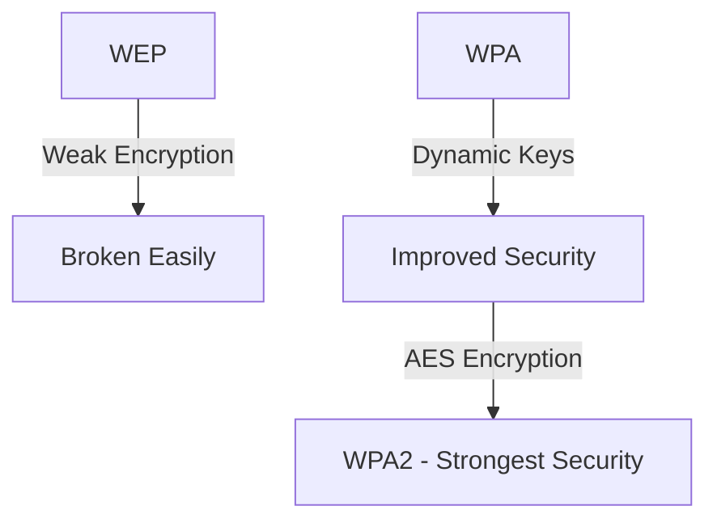
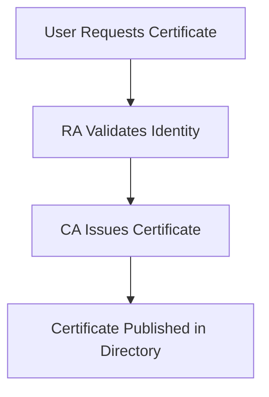

## Hashing 

Hashing is a fundamental technique in information security that ensures data integrity by generating a fixed-length output, called a **hash**, from an input of any size. This section covers the principles, properties, and applications of hashing, along with techniques to protect hashed data.

- **Definition:** A mathematical algorithm transforms input data (file, message, or password) into a fixed-length string, known as a **hash value**.
- **Purpose:** Used to verify data integrity by ensuring the data hasn't been altered.
#### Example:
The MD5 hash of 'hello' is:
```
5d41402abc4b2a76b9719d911017c592
```
### **Hash Functions**
- **Purpose:** Converts variable-length input into fixed-length output.
- **Common Uses:**
    - Password storage and verification.
    - Message authentication.
    - Digital signatures.
- **Outputs:** Often called **hash values**, **digests**, or **codes**.
#### Key Properties of Hash Functions:
1. **Uniqueness:** Different inputs generate unique hashes.
2. **Fixed Length:** Output length is constant, regardless of input size.
3. **Irreversibility:** Hashes cannot be reversed to retrieve original input.


### **Hashing Applications**

1. **Password Protection:**
    - Passwords are hashed and stored securely.
    - On login, the entered password is hashed and compared to the stored hash.
2. **Data Integrity Verification:**
    - Ensures data hasn't been tampered with during transmission.
3. **Digital Signatures:**
    - Verifies the authenticity of messages.

### **Attacks on Hashes**

#### Brute-Force Attack
- **Method:** Tries every possible password combination.
- **Countermeasure:** Limit login attempts or increase hash complexity.
#### Dictionary Attack
- **Method:** Matches hashes against precomputed hash values of dictionary words.
- **Countermeasure:** Use strong, random passwords and additional techniques like **salting**.
### **Defenses Against Attacks**

#### Salting
- **Definition:** Adds random data (salt) to passwords before hashing to make attacks more complex.
- **Example:**

```
Password: passwOrd
Salt: 73950
Hashed Output: 8f6e9170f91e88c4a5a132c4e5d3e3f1
```

- **Benefits:**
    - Increases hash complexity.
    - Requires attackers to generate hashes for every salt value.



#### Key Stretching
- **Purpose:** Slows down hash computation to make brute-force infeasible.
#### Encrypting Hashes
- **Purpose:** Encrypts hashed values to add an extra layer of security.
- **Techniques:**
    - Hardware Security Modules (HSM) for key management.
### **Hashing Algorithms**
#### Popular Algorithms:

|Algorithm|Hash Size (bits)|Year Published|
|---|---|---|
|MD5|128|1992|
|SHA-1|160|1995|
|SHA-2|Up to 512|2001|
|SHA-3|Up to 512|2015|

#### Example MD5 Hash:

```
Input: hello
Output: 5d41402abc4b2a76b9719d911017c592
```

### **Collisions**

- **Definition:** Occurs when two different inputs generate the same hash.
- **Impact:** Reduces trust in hash integrity.
- **Solutions:**
    - Transition to SHA-2 and SHA-3 to avoid vulnerabilities in older algorithms like MD5 and SHA-1.

### **Benefits and Limitations**

#### Benefits:

- Ensures data integrity.
- Simplifies password verification.

#### Limitations:

- Vulnerable to dictionary attacks without salting.
- Cannot guarantee data authenticity or confidentiality.

Hashing is a critical tool in securing information by ensuring integrity, verifying identity, and enabling secure authentication. However, without additional safeguards like salting, encryption, and modern algorithms, hashing alone may not prevent attacks.

## Cryptography

Cryptography is the science of securing information through encoding techniques. It encompasses encryption, decryption, and methods to protect data confidentiality, integrity, and authenticity. This section explores cryptography fundamentals, encryption types, and symmetric encryption.
### **Cryptography Basics**

- **Cryptology:** The study of securing information, including cryptography (creation of secure systems) and cryptanalysis (breaking secure systems).
- **Encryption:** Converts plaintext into ciphertext to prevent unauthorized access.
- **Decryption:** Restores ciphertext back into plaintext.
- **Cipher:** An algorithm used to encrypt and decrypt data.
- **Key:** Data used in the encryption and decryption process.
### Example Workflow:



### **Applications of Cryptography**

1. **Secure Communications:** Protects sensitive conversations over networks (e.g., emails, VoIP).
2. **Data Encryption:** Secures files and storage devices.
3. **Authentication:** Verifies identity in online transactions.
4. **Digital Signatures:** Ensures message authenticity and integrity.
5. **Financial Security:** Safeguards online banking and payment systems.

## Encryption

Encryption obscures information so that only authorized parties can decode it using a **key**.
#### Historical Context
- Used in ancient times (e.g., Caesar Cipher).
- Modern encryption emerged during World War II with machines like **Enigma**.
- Today, computers enable complex algorithms for secure encryption.

### **Types of Cryptographic Algorithms**

Cryptographic algorithms fall into two main categories:

1. **Symmetric Encryption** - Single key for encryption and decryption.
2. **Asymmetric Encryption** - Separate public and private keys.

### **Symmetric Encryption**

Symmetric encryption uses the same **secret key** for both encryption and decryption, ensuring high speed and simplicity.
#### Example Process:


#### Key Features:

- **Fast:** Suitable for encrypting large amounts of data.
- **Requires Key Exchange:** Both parties must securely share the key beforehand.
- **Vulnerability:** If the key is compromised, security is breached.
#### Applications:
- Secure data transmission.
- Wireless network encryption (e.g., WPA2).

#### **Symmetric Encryption Algorithms**

##### Data Encryption Standard (DES)

- **Key Length:** 56 bits.
- **Block Size:** 64 bits.
- **Process:** Breaks plaintext into blocks, encrypts each block through multiple rounds.
- **Limitations:** Vulnerable to brute-force attacks due to short key length.

##### Triple DES (3DES)

- Enhanced version of DES.
- **Key Length:** 112 or 168 bits.
- **Process:** Applies DES encryption three times.
- **Use Cases:** Still found in banking and older systems.

##### Advanced Encryption Standard (AES)

- **Key Length:** 128, 192, or 256 bits.
- **Block Size:** 128 bits.
- **Security:** More secure than DES and 3DES, resistant to brute-force attacks.
- **Use Cases:** Government and commercial encryption standards.

#### **Key Length and Security**

- **Short Keys:** Vulnerable to brute-force attacks (e.g., DES).
- **Longer Keys:** Provide better security but require more processing power.

|Key Length|Max Operations Required|Time to Crack (Estimated)|
|---|---|---|
|56 bits|7.2 × 10^16|Hours to days|
|128 bits|3.4 × 10^38|Billions of years|
|256 bits|1.1 × 10^77|Infeasible|

#### **Session Keys**

- Temporary keys used for one session only.
- Provides additional protection as new keys are generated for each session.
- Prevents attackers from exploiting reused keys.

Symmetric encryption is fast, efficient, and widely used for securing large volumes of data. However, it requires careful management of key distribution and length to avoid vulnerabilities. AES has become the modern standard due to its strength and versatility.

### **Asymmetric Encryption**

Asymmetric encryption, also known as **public-key encryption**, uses two mathematically related keys — a **public key** and a **private key** — to encrypt and decrypt data. This method solves the key distribution problem of symmetric encryption by separating encryption and decryption processes.

#### **How Asymmetric Encryption Works**
- **Key Pair:**
    - **Public Key:** Used to encrypt data. Can be shared openly.
    - **Private Key:** Used to decrypt data. Must be kept secure.
- **Process:**
    1. Sender encrypts a message using the recipient's **public key**.
    2. Recipient decrypts the message using their **private key**.


#### **Key Features**
- **Security:** Protects data without requiring a shared secret key.
- **Flexibility:** Enables secure communication between parties without prior contact.
- **Authentication:** Provides mechanisms for verifying the sender’s identity using **digital signatures**.
#### **Key Applications**

1. **Email Encryption:** Secure exchange of confidential emails.
2. **Digital Signatures:** Authenticates the sender and ensures message integrity.
3. **Secure File Transfers:** Safeguards sensitive data.
4. **SSL/TLS Protocols:** Establishes secure web connections.

#### **Example Scenario: Alice and Bob**
- **Alice wants to send Bob a secret message:**
    1. Bob shares his **public key** with Alice.
    2. Alice encrypts her message using Bob’s **public key**.
    3. Bob decrypts the message using his **private key**.



#### **Key Strength and Security**

- **Key Lengths:**
    - Typically 1,024, 2,048, or 4,096 bits.
    - Longer keys provide higher security.
- **Comparative Security:**
    - 128-bit symmetric key ≈ 2,048-bit asymmetric key in security strength.

#### **Digital Signatures**

- Uses asymmetric encryption to verify data authenticity and integrity.
- Provides **nonrepudiation**, ensuring the sender cannot deny sending the message.
##### Process:
1. Sender hashes the data.
2. Hash is encrypted with sender’s **private key**, creating a **digital signature**.
3. Receiver decrypts the signature using the sender’s **public key** and compares the hash.



#### **Digital Certificates**

- **Digital Certificates:** Electronic documents that bind a public key to an entity, verified by a **Certificate Authority (CA)**.
##### Components:
- Public key.
- Owner’s identity details.
- Issuer’s information (CA).
- Expiry date.
- Digital signature of the CA.

#### **Advantages and Limitations**
##### Advantages:
- Eliminates key distribution issues.
- Supports authentication and integrity verification.
- Suitable for public and large-scale applications.
##### Limitations:
- Slower than symmetric encryption due to computational complexity.
- Requires a trusted **Certificate Authority** for managing keys.
- Vulnerable to man-in-the-middle attacks if public keys are tampered with.

Asymmetric encryption addresses the limitations of symmetric encryption by using key pairs, enabling secure key exchanges and authentication mechanisms. While it provides enhanced security and flexibility, its computational overhead necessitates hybrid approaches that combine symmetric and asymmetric methods for optimal performance.

## Secure Web Connections and Protocols

Secure web connections leverage encryption protocols and standards to protect data during transmission, ensuring confidentiality, integrity, and authentication. This section explores protocols like **SSL/TLS**, email security methods, and encryption standards for wireless networks.

### **Web Traffic Security**
- **Default State:** Web traffic is transmitted as plaintext, making it vulnerable to eavesdropping.
- **Solution:** Use secure communication protocols to encrypt traffic and authenticate participants.
#### Key Components:
- **TLS (Transport Layer Security):** Ensures encrypted communication.
- **SSL (Secure Sockets Layer):** Predecessor to TLS, commonly used in HTTPS.
- **HTTPS (Hypertext Transfer Protocol Secure):** Secure version of HTTP using SSL/TLS.


### **Protocols for Secure Communications**

#### Internet and Email Security Protocols

|Protocol|Purpose|
|---|---|
|**SSL/TLS**|Secure network communications (web browsing).|
|**HTTPS**|Secure web browser communication.|
|**S/MIME** (Secure/Multipurpose Internet Mail Extensions)|Email encryption and authentication.|
|**PGP** (Pretty Good Privacy)|Encrypts and signs emails and files.|
|**PEM** (Privacy Enhanced Mail)|Standardized email encryption.|
|**SET** (Secure Electronic Transactions)|Protects online payment data.|

#### Wireless Network Security

|Protocol|Features|
|---|---|
|**WEP (Wired Equivalent Privacy)**|Early encryption standard; weak security.|
|**WPA (Wi-Fi Protected Access)**|Improved encryption and dynamic keys.|
|**WPA2**|Strong encryption using AES; widely used today.|
|**RSN (Robust Secure Network)**|Next-generation wireless security protocols.|

##### WEP vs WPA Comparison:


###  **IP Security (IPSec)**

- **Definition:** Provides secure communication at the network layer.
- **Key Features:**
    - Encryption of IP packets.
    - Authentication via digital certificates.
    - Integrity protection.

### **Digital Certificates and PKI**

#### Digital Certificates

- **Purpose:** Validates identity by binding a public key to its owner.
- **Issued by:** **Certificate Authorities (CAs).**
- **Contents:**
    - Owner’s identity.
    - Public key.
    - CA’s signature.

#### Public Key Infrastructure (PKI)

- **Definition:** Framework for managing public keys and certificates.
- **Components:**
    1. **Certificate Authority (CA):** Issues and revokes certificates.
    2. **Registration Authority (RA):** Authenticates users before certificates are issued.
    3. **Key Management Systems:** Maintain key pairs securely.



### **Email Security Mechanisms**

#### S/MIME (Secure/Multipurpose Internet Mail Extensions)

- Provides encryption, authentication, and integrity verification.
- Uses digital signatures for authentication.

#### PEM (Privacy Enhanced Mail)

- Uses 3DES and RSA for encryption and key exchange.

#### PGP (Pretty Good Privacy)

- Encrypts and signs messages for privacy and authentication.
- Allows users to maintain their own public key directories.

### **Securing Transactions and Payments**

#### Secure Electronic Transactions (SET):

- Developed by MasterCard and VISA.
- Encrypts credit card information during online transactions.
- Provides:
    - **Authentication:** Verifies cardholder and merchant identities.
    - **Integrity:** Ensures data hasn’t been altered.
    - **Confidentiality:** Encrypts sensitive information.
