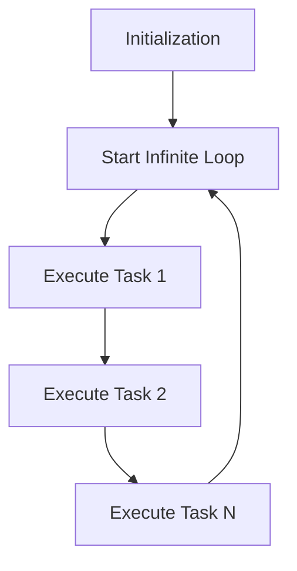

# Real-Time Programming Concepts

### Introduction
Real-time systems are designed to react to external events within precise timing constraints. Examples include:
- **Engine Controllers**
- **Seatbelt Monitors**
#### Deadline Characteristics
- **Periodic Tasks**: Execute at regular intervals (e.g., multiple-rate periodicity).
- **Aperiodic Tasks**: Occur irregularly.
Deadlines are classified as:
- **Hard Deadlines**: Missing the deadline causes system failure.
- **Soft Deadlines**: Missing the deadline results in degraded performance.
The software architecture of such systems can adopt various strategies, including:
- **Super Loop Architecture**
- **Foreground/Background Architecture**
- **Scheduling of multiple processes (Multiple scheduling policies)**
---

### Super Loop Architecture
The **Super Loop Architecture** is a straightforward structure where an infinite loop continuously executes tasks sequentially.
```c
void main(void) {
    /* Initialization */
    while (1) {
        Task1();
        Task2();
        Task3();
    }
}
```
#### Key Features
1. **Initialization**: Performed once before entering the loop.
2. **Task Execution**: Tasks are executed sequentially within the infinite loop.
3. **Loop Behavior**: A variant of batch processing, operating cyclically.
#### Challenges
- **Determinism**: Response time depends on the loop's execution time, making it unpredictable.
- **Responsiveness**: Timely response is hard to guarantee for tasks with strict deadlines.
- **Polling Periodicity**: Ensuring precise timing for task execution is challenging.
- **Multi-rate Systems**: Handling tasks with widely varying frequencies is impractical.
#### Advantages
- Simple to implement.
- Minimal hardware resource requirements.
- Highly portable.
#### Disadvantages
- Inaccurate timing.
- High power consumption.
#### Flow


---
### الملخص
الـ **Super Loop** من أبسط أنظمة البرمجة في العموم. هو برنامج فيه **لوب لانهائي** بتتنفذ فيه المهام المطلوبة ورا بعض.
#### مشكلته
- **الاستجابة**: لو فيه حاجة حصلت وأنت في نص مهمة تانية بيبقى صعب تستجيب سريعا.
- **توقيت مهمات**: مش دقيق لأن الحساب مش ثابت.
#### مثال بسيط
تخيل بودا في مكتب بيمر على كل درج ويفتحه يشوف فيه فلوس ولا لا. لو فلوس بياخدها ويكمل مع الباقي.

### Foreground/Background Architecture

The **Foreground/Background Architecture** divides system operations into two levels:
1. **Foreground**: Handles asynchronous, time-critical tasks via **Interrupt Service Routines (ISRs)**.
2. **Background**: Executes less critical tasks sequentially within an infinite loop.
```cpp
void main(void) {
    /* Initialization */
    while (1) {
        ADC_Read();
        SPI_Read();
        USB_Packet();
    }
}

void ISR_USB(void) {
    Clear_Interrupt();
    Read_Packet();
}
```
#### Key Features
1. **Interrupt-Driven Foreground**: Reactive tasks respond to events immediately.
2. **Background Tasks**: Use remaining CPU cycles for non-critical operations.
#### Challenges
- **Responsiveness**: Longer interrupt latency may delay critical responses.
- **Determinism**: Task response times are difficult to predict due to non-uniform execution times.
- **Complexity**: Becomes difficult to manage for systems requiring multi-rate scheduling.
#### Advantages
- Faster response to critical events.
- Efficient use of CPU resources.
#### Disadvantages
- Increased complexity with growing task diversity.
- Longer interrupt latency for deeply nested ISRs.
#### Flow
![[{0C4B818F-A72F-4DD5-A073-72F58C903F06}.png]]

---
### الملخص

العمل المشترك ما بين الخلفية والمقدمة في النظام ده بيعتمد على تقسيم الوظائف:
- **المقدمة (الفورية)**: معالجة الاحداث من خلال مقاطعة الإشارات.
- **الخلفية**: بتشتغل في وقت فراغ المعالج لإنجاز المهام الأقل ضرورة.
#### مثال بسيط
تخيل موظف في مكتب بيفتح البوابة كل ما يسمع الجرس (المقدمة) ويروق ملفاته في الوقت الفاضي (الخلفية).