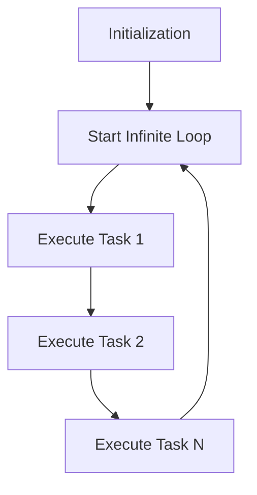

### Introduction
Real-time systems are designed to react to external events within precise timing constraints. Examples include:
- **Engine Controllers**
- **Seatbelt Monitors**
#### Deadline Characteristics
- **Periodic Tasks**: Execute at regular intervals (e.g., multiple-rate periodicity).
- **Aperiodic Tasks**: Occur irregularly. Deadlines are classified as:
- **Hard Deadlines**: Missing the deadline causes system failure.
- **Soft Deadlines**: Missing the deadline results in degraded performance. The software architecture of such systems can adopt various strategies, including:
- **Super Loop Architecture**
- **Foreground/Background Architecture**
- **Scheduling of multiple processes (Multiple scheduling policies)**

---
### Super Loop Architecture
The **Super Loop Architecture** is a straightforward structure where an infinite loop continuously executes tasks sequentially.
```c
void main(void) {
    /* Initialization */
    while (1) {
        Task1();
        Task2();
        Task3();
    }
}
```
#### Key Features
1. **Initialization**: Performed once before entering the loop.
2. **Task Execution**: Tasks are executed sequentially within the infinite loop.
3. **Loop Behavior**: A variant of batch processing, operating cyclically.
#### Challenges
- **Determinism**: Response time depends on the loop's execution time, making it unpredictable.
- **Responsiveness**: Timely response is hard to guarantee for tasks with strict deadlines.
- **Polling Periodicity**: Ensuring precise timing for task execution is challenging.
- **Multi-rate Systems**: Handling tasks with widely varying frequencies is impractical.
#### Advantages
- Simple to implement.
- Minimal hardware resource requirements.
- Highly portable.
#### Disadvantages
- Inaccurate timing.
- High power consumption.
#### Flow

---

<div dir="rtl"> 

### الملخص

الـ **Super Loop** من أبسط أنظمة البرمجة في العموم. هو برنامج فيه **لوب لانهائي** بتتنفذ فيه المهام المطلوبة ورا بعض.

#### مشكلته

- **الاستجابة**: لو فيه حاجة حصلت وأنت في نص مهمة تانية بيبقى صعب تستجيب سريعا.
- **توقيت مهمات**: مش دقيق لأن الحساب مش ثابت.

#### مثال بسيط

تخيل بودا في مكتب بيمر على كل درج ويفتحه يشوف فيه فلوس ولا لا. لو فلوس بياخدها ويكمل مع الباقي.

</div> 

---
### Foreground/Background Architecture
The **Foreground/Background Architecture** divides system operations into two levels:
1. **Foreground**: Handles asynchronous, time-critical tasks via **Interrupt Service Routines (ISRs)**.
2. **Background**: Executes less critical tasks sequentially within an infinite loop.

```cpp
void main(void) {
    /* Initialization */
    while (1) {
        ADC_Read();
        SPI_Read();
        USB_Packet();
    }
}

void ISR_USB(void) {
    Clear_Interrupt();
    Read_Packet();
}
```
#### Key Features
1. **Interrupt-Driven Foreground**: Reactive tasks respond to events immediately.
2. **Background Tasks**: Use remaining CPU cycles for non-critical operations.
#### Challenges
- **Responsiveness**: Longer interrupt latency may delay critical responses.
- **Determinism**: Task response times are difficult to predict due to non-uniform execution times.
- **Complexity**: Becomes difficult to manage for systems requiring multi-rate scheduling.
#### Advantages
- Faster response to critical events.
- Efficient use of CPU resources.
#### Disadvantages
- Increased complexity with growing task diversity.
- Longer interrupt latency for deeply nested ISRs.
#### Flow
![[{0C4B818F-A72F-4DD5-A073-72F58C903F06}.png]]
---

<div dir="rtl"> 

### الملخص

العمل المشترك ما بين الخلفية والمقدمة في النظام ده بيعتمد على تقسيم الوظائف:

- **المقدمة (الفورية)**: معالجة الاحداث من خلال مقاطعة الإشارات.
- **الخلفية**: بتشتغل في وقت فراغ المعالج لإنجاز المهام الأقل ضرورة.

#### مثال بسيط

تخيل بودا بواب بيفتح البوابة كل ما يسمع الجرس (المقدمة) ويسرق في الوقت الفاضي (الخلفية).

</div> 

---
### Multi-Rate Systems
**Multi-Rate Systems** manage tasks with varying timing requirements, including synchronous and asynchronous tasks.
#### Key Characteristics
- **Synchronous Periodic Tasks**: Repeat at different rates (e.g., spark control every 2 ms).
- **Aperiodic Tasks**: Triggered by irregular events (e.g., button press).
- **Modern Applications**: Common in systems like automobile engine controllers.
#### Challenges
- Keeping track of both synchronous and asynchronous tasks.
- Applying different timing requirements to each task type.
- Major limitations of **Super Loop** and **Foreground/Background Architectures** in handling multi-rate systems effectively.
---

<div dir="rtl"> 

### الملخص
في أنظمة المعالجة متعددة السرعات:
- **المهام الدورية**: بتتنفذ في مواعيد محددة ومختلفة في نفس الوقت.
- **المهام غير الدورية**: بتحصل غير منظمة ولازم تعامل مختلف مع متطلباتها.
#### مثال بسيط
تخيل بودا بيسرق كل 2 ثانية ويتوب كل 1000 ثانية. كل مهمة لها توقيتها والنظام يعتمد على التنسيق بين هذه المهام.

</div> 


<div dir="rtl"> 

# مقارنة سريعه

| النوع                     | المميزات                                                     | العيوب                                                    |
| ------------------------- | ------------------------------------------------------------ | --------------------------------------------------------- |
| **Super Loop**            | بسيط وسهل التنفيذ.                                           | غير دقيق في التوقيت.                                      |
|                           | لا يحتاج موارد كبيرة.                                        | صعوبة في التعامل مع المهام متعددة السرعات (Multi-rate).   |
|                           | سهل النقل بين الأنظمة.                                       | استجابة بطيئة للأحداث الطارئة.                            |
| **Foreground/Background** | استجابة أسرع للأحداث الحرجة من خلال الانتربت (Interrupts).   | تعقيد أكبر مع زيادة عدد المهام.                           |
|                           | استغلال فعال لقدرات المعالج.                                 | زمن تأخير الانتربت قد يؤخر المهام الحرجة.                 |
|                           |                                                              | تحديات في التحكم في الأنظمة متعددة السرعات.               |
| **Multi-Rate Systems**    | يمكنه التعامل مع المهام الدورية وغير الدورية بمواقيت مختلفة. | يتطلب تنسيق معقد بين المهام المختلفة.                     |
|                           | مناسب للتطبيقات الحديثة مثل أنظمة السيارات.                  | صعب التنفيذ باستخدام Super Loop أو Foreground/Background. |
### ملخص بسيط

- **Super Loop**: مناسب لو المهام بسيطة ومش محتاجة توقيت دقيق، لكن استجابته بطيئة ومش هينفع مع الأنظمة المعقدة.
- **Foreground/Background**: أحسن في التعامل مع الأحداث الفورية لكنه معقد شوية وصعب يظبط توقيت المهام المتعددة.
- **Multi-Rate Systems**: أحسن حاجة للأنظمة الحديثة والمعقدة زي أنظمة السيارات، بس محتاج نظام إدارة قوي ومناسب ليه.

</div> 