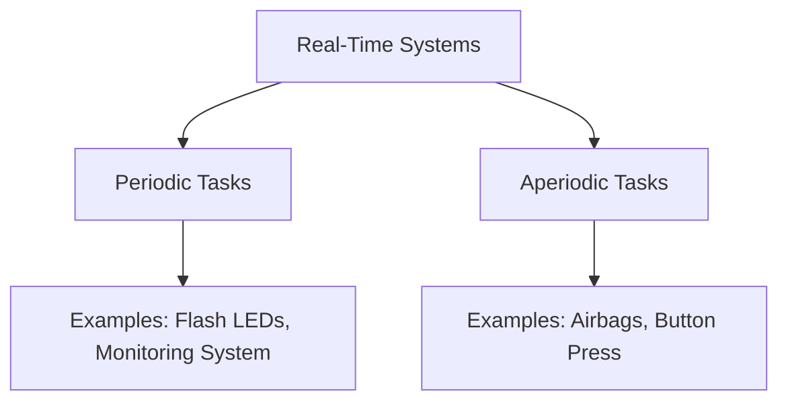
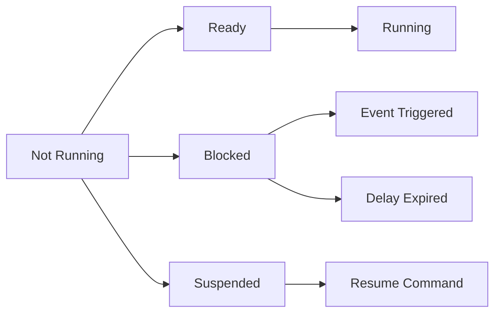

## Operating Systems Overview
- **Definition**: Software managing hardware resources.
- **Key Characteristics**:
    - Resource management.
    - Acts as an interface between applications and hardware.
    - Offers a library of functions for applications.
### Embedded Operating Systems (OS)
- **Fusion of application and OS**:
    - Resides mostly in ROM.
- **Characteristics**:
    - Less overhead.
    - Configurable (only required components are included).
    - Device drivers often moved out of OS to tasks.
### Desktop vs Embedded OS

| Feature     | Desktop OS             | Embedded OS               |
| ----------- | ---------------------- | ------------------------- |
| Compilation | Separate               | Together with application |
| Startup     | Applications run first | Application starts RTOS   |

---

## Real-Time Systems (RTS)

> **Definition**: Systems where correctness depends on both logical results and timing.
### Characteristics
- Controlled by sensors and actuators.
- Strict timing constraints (deadlines):
    - **Periodic Tasks**: Time-driven (e.g., flashing LEDs).
    - **Aperiodic Tasks**: Event-driven (e.g., airbag deployment).
### Deadline Types
- **Soft**: Minor delay acceptable.
- **Firm**: No delay allowed but no catastrophic outcome.
- **Hard**: Catastrophic outcome if missed.
### Goals of RTOS
- Meet deadlines with deterministic scheduling.
- Efficient resource management with minimal overhead.


---
## RTOS Requirements
- **Predictability**:
    - Upper bound on execution time for services.
    - Deterministic scheduling policies.
- **Precise Timing Services**:
    - High resolution.
    - Short interrupt disabling periods.
## Functionality of RTOS Kernel
- Processor management 
- Memory management 
- Timer management resource management 
- Task management (resume, wait, etc.) 
- Inter-task communication
- Task synchronization

---
## FreeRTOS Overview
- **Purpose**: Multitasking facilities with a simple scheduler.
- **Features**:
    - Fully preemptive with priority-based multitasking.
    - Supports communication (queues) and resource sharing (semaphores).
    - Minimal CPU and memory footprint.
### Tasks in FreeRTOS
- **Definition**: Basic unit of scheduling (similar to threads).
- **Structure**:
    - Must return `void` and take a `void pointer` parameter.
    - Run in infinite loops and do not return.
```c
void ATaskFunction(void *pvParameters) {
    for (;;) {
        // Task implementation
    }
}
```
---
## Task States in FreeRTOS



### Description of States
- **Running**: Actively executing (one at a time on single-core systems).
- **Ready**: Ready to execute but waiting for higher-priority tasks to finish.
- **Blocked**: Waiting for an event (e.g., timer, resource availability).
- **Suspended**: Explicitly halted and resumed via API calls.
