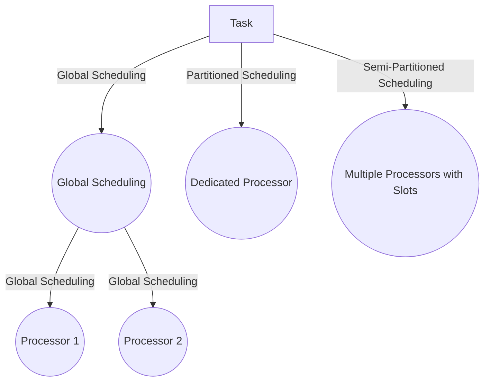

## Multiprocessor Models

Multiprocessor systems are categorized based on processor characteristics:

- **Identical (Homogeneous):** All processors share identical characteristics, ensuring execution time is processor-independent.
- **Uniform:** Execution time is proportional to processor speed, with faster processors completing tasks quicker.
- **Unrelated (Heterogeneous):** Each job has a unique execution time for each processor.

---
## Scheduling in Multiprocessor Systems

Scheduling involves deciding **when** and **where** a task will run, adding complexity compared to uniprocessor systems. This requires monitoring both tasks and processors.
### Types of Scheduling Models
#### Global Scheduling

- Tasks can execute on any processor.
- Utilizes a **global ready queue**.
- Example methods:
    - **Global-EDF:** Chooses the M jobs with the shortest deadlines.
    - **Global-RM:** Selects M jobs with the highest priorities.
- **Advantages:** Load balancing, dynamic scheduling.
- **Disadvantages:** High online overhead and job migration overhead.
#### Partitioned Scheduling

- Tasks are statically assigned to specific processors.
- Scheduling occurs per processor.
- **Advantages:** No migration overhead, simple queue management.
- **Disadvantages:** Task allocation is NP-hard.
#### Semi-Partitioned Scheduling

- Combines partitioning with limited migration.
- Requires online overhead but balances task allocation flexibility.

---
## Problems in Multiprocessor RT Systems

- **Feasibility Problem:** Determining if tasks can meet deadlines.
- **Run-Time Scheduling Problem:** Deciding real-time execution order.
- **Schedulability Problem:** Ensuring the task set is schedulable under a given model.

---
## Scheduling Methods and Algorithms

### Global Scheduling

- Maintains a single system-wide queue.
- Task migration between processors is allowed.
- **Limitations:** Non-optimal results for simple algorithms like EDF.
### Partitioned Scheduling

- Uses bin-packing heuristics to allocate tasks to processors:
    - **First-Fit (FF):** Assigns to the first processor with available capacity.
    - **Best-Fit (BF):** Chooses the processor with the most suitable utilization.
    - **Worst-Fit (WF):** Assigns to the processor with the least utilization.

---
## Advantages and Disadvantages of Scheduling Models

| **Model**                  | **Advantages**                                                                                  | **Disadvantages**                |
| -------------------------- | ----------------------------------------------------------------------------------------------- | -------------------------------- |
| **Global Scheduling**      | Automatic load balancing. Dynamic rescheduling capabilities. Lower average response time. | Job migration overhead.          |
| **Partitioned Scheduling** | Core isolation. No migration overhead. Simplified queue management.                       | NP-hard task allocation problem. |

---
## Key Insights from Comparisons

- Certain task sets are only schedulable with global or partitioned scheduling.
- Global scheduling requires advanced priority assignment and migration support.
- Partitioned scheduling relies on efficient heuristic algorithms for optimal allocation.

## Global Scheduling

 

 الموضوع زي لما يكون عندك صف طويل من الناس مستنية تتخدم وكل واحد بياخد دوره هنا البروسيسورات كلها شغالة على الصف ده يعني أي بروسيسور فاضي هيشيل أول شغل موجود.

- **مميزاته:**
1. الشغل بيتوزع لوحده بين البروسيسورات فلو واحد فاضي يشيل شغل بسرعة.
2. مناسب لو الحمل بيتغير كتير ومش ثابت.
- **عيوبه:**
1. ساعات الشغل بيحتاج يتنقل من بروسيسور للتاني وده بياخد وقت ومجهود.
2. الطابور العالمي ده محتاج إدارة دقيقة عشان مايحصلش لخبطة.

 

## Partitioned Scheduling

 

الحكاية هنا مختلفة شوية كل بروسيسور بياخد نصيبه من الشغل من البداية وبيشتغل على شغله بس طول الوقت يعني كل واحد واخد شغلته محدش يلمسها وبعدها بقى بعمل الscheduling باستخدام اي طريقه قديمه بقى EDF او RM.
- **مميزاته:**
1. مفيش شغل بيتنقل بين البروسيسورات فالشغل بيتم أسرع.
2. سهل في الإدارة لأن كل بروسيسور عارف هو شغال على إيه.
- **عيوبه:**
1. توزيع الشغل بين البروسيسورات في الأول ممكن يكون معقد وعايز خوارزميات.
2. لو حصل تغيير مفاجئ في كمية الشغل صعب تعيد توزيع الحمل.

 

![[{FF433506-7D01-4F34-9F6A-6B1100842B6A}.png]]